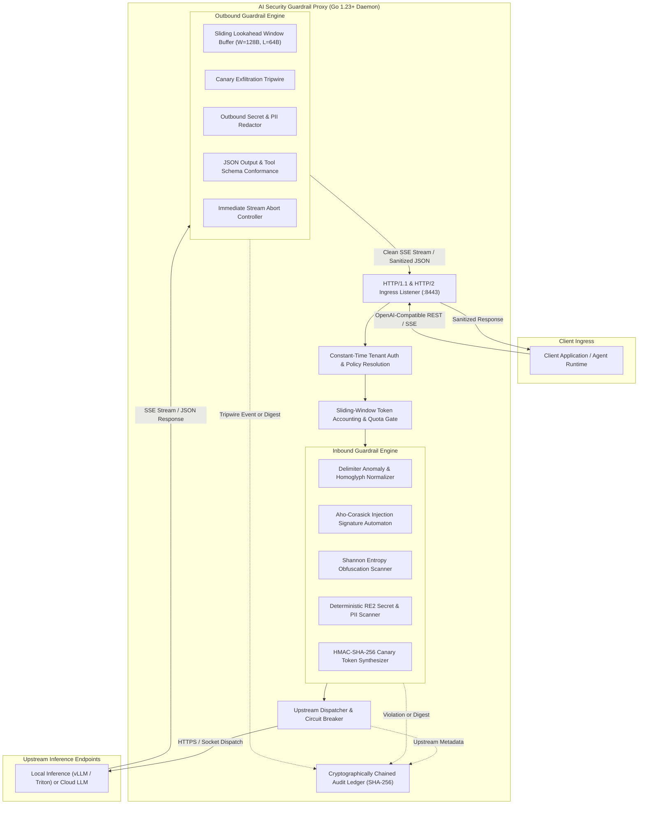
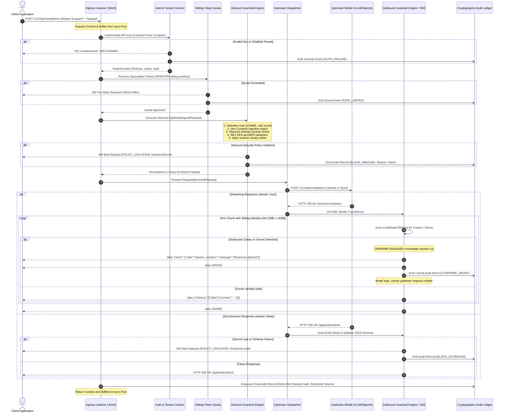
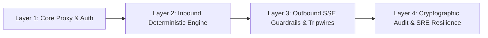

# AI Security Guardrail Proxy Master Design Document

## Document Metadata
- **Status**: Approved for Implementation
- **Version**: 1.0.0
- **Domain**: AppSec / AI Infrastructure / Site Reliability Engineering (SRE)
- **Implementation Language**: Go 1.23+ with ZERO external dependencies (standard library only: `net/http`, `sync`, `crypto`, `context`, `regexp`, `math`, `encoding/json`, `os`, `time`)
- **Primary References**:
  - Foundational Philosophy: [00-PROJECT-PHILOSOPHY.md](file:///root/company-project-specs/00-PROJECT-PHILOSOPHY.md)
  - Project Spec: [09-ai-security-guardrail-proxy.md](file:///root/company-project-specs/09-ai-security-guardrail-proxy.md)
  - Deep Architecture Specification: [ARCHITECTURE.md](file:///root/ai-security-guardrail-proxy/docs/ARCHITECTURE.md)
  - Security Boundaries & Threat Modeling: [SECURITY-BOUNDARIES.md](file:///root/ai-security-guardrail-proxy/docs/SECURITY-BOUNDARIES.md)
  - Threat Model & Attack Vectors: [THREAT-MODEL.md](file:///root/ai-security-guardrail-proxy/docs/THREAT-MODEL.md)
  - Failure Modes & Effects Analysis: [FAILURE-MODES.md](file:///root/ai-security-guardrail-proxy/docs/FAILURE-MODES.md)
  - Service Level Objectives & Telemetry: [SLO.md](file:///root/ai-security-guardrail-proxy/docs/SLO.md)
  - Operational Runbooks & Deployment: [OPERATIONS.md](file:///root/ai-security-guardrail-proxy/docs/OPERATIONS.md)
  - Architectural Decision Records:
    - [ADR-001: Language & Runtime Selection](file:///root/ai-security-guardrail-proxy/docs/adr/ADR-001-language-and-runtime-selection.md)
    - [ADR-002: Deterministic Linear Inspection Pipeline](file:///root/ai-security-guardrail-proxy/docs/adr/ADR-002-deterministic-inspection-pipeline.md)
    - [ADR-003: Streaming Chunk Inspection and Tripwires](file:///root/ai-security-guardrail-proxy/docs/adr/ADR-003-streaming-chunk-inspection-and-tripwires.md)
    - [ADR-004: Canary Token and Pseudonymization Lifecycle](file:///root/ai-security-guardrail-proxy/docs/adr/ADR-004-canary-token-and-pseudonymization-lifecycle.md)
    - [ADR-005: Cryptographic Hash-Chained Audit Ledger](file:///root/ai-security-guardrail-proxy/docs/adr/ADR-005-cryptographic-hash-chained-audit-ledger.md)

---

## 1. Executive Summary & Thesis

### 1.1 The Operational Problem
Enterprise applications interfacing with Large Language Models (LLMs) face immediate, critical security exposures:
1. **Direct and Indirect Prompt Injection**: Adversarial payloads subverting system prompts, overriding guard instructions, or executing unauthorized model capabilities.
2. **Data Exfiltration and Secret Leakage**: Accidental inclusion of API keys, database credentials, tokens, or PII in prompts, or models generating and leaking internal proprietary context in completions.
3. **Unbounded Spending & Quota Exhaustion**: Runaway agentic loops, denial-of-wallet attacks, and unconstrained token consumption starving downstream services.
4. **Non-Deterministic Security Failures**: Delegating safety enforcement to external SaaS APIs or probabilistic "LLM-as-a-judge" secondary models introduces:
   - Severe latency penalties (300ms to 2500ms overhead per call).
   - Massive recursive operational expenses ($0.005–$0.03 per inspection).
   - Transitive data privacy leaks to third-party cloud vendors.
   - Network failure modes that either fail open (creating critical security holes) or fail closed (causing systemic outages).
   - Inherent probabilistic bypasses: attacks like jailbreaks, homoglyphs, and prompt injections can deceive an evaluator LLM just as easily as the primary model.

### 1.2 The Core Thesis

> **"AI proposes. Deterministic systems enforce. Zero external dependencies."**

The AI Security Guardrail Proxy provides deterministic, line-rate security inspection and policy enforcement directly in the network data path. It is engineered as a self-contained, statically linked Go binary running entirely within local infrastructure.

Key architectural pillars:
- **Deterministic Enforcement**: Every security boundary is evaluated via mathematically verifiable, linear-time algorithms ($O(N)$ Aho-Corasick multi-pattern matchers, non-backtracking DFA regular expressions, Shannon entropy thresholds, and exact token delimiters). A probabilistic model is never the arbiter of security enforcement.
- **Zero External Dependencies**: The entire proxy compiles with standard Go 1.23+ libraries (`net/http`, `sync`, `crypto`, `context`, `regexp`). No third-party network APIs, external vector databases, or remote threat-intelligence services are queried in the data path.
- **Line-Rate Performance**: Sub-millisecond inspection overhead ($p_{99} < 1\text{ms}$ for non-streaming payload analysis) through zero-allocation memory pools (`sync.Pool`), zero-copy slice inspection, and precompiled automata.
- **Immediate Streaming Tripwires**: Server-Sent Events (SSE) responses are inspected through a fixed sliding lookahead window ($W=128\text{ bytes}, L=64\text{ bytes}$). If a sensitive pattern or canary leak is detected, the stream is severed instantly before malicious or leaked bytes can cross the downstream network boundary.
- **Cryptographic Auditability**: Every inspection decision and raw payload digest is logged into a SHA-256 hash-chained append-only journal, providing tamper-evident proof of all policy evaluations.

---

## 2. Complete System Architecture & Request Lifecycle

### 2.1 Component Architecture



### 2.2 End-to-End Request Lifecycle Sequence Diagram



---

## 3. Core Engine Specifications

### 3.1 Linear Inspection Pipeline State Machine
The proxy executes an explicit, non-allocating linear state machine rather than nested middleware onion layers:
- **Zero Heap Allocation on Fast Path**: All internal per-request data structures (`PipelineContext`), byte buffers (`[]byte`), and scanner scratchpads are acquired from structured `sync.Pool` allocators and recycled at completion.
- **Fail-Safe Checkpointing**: Each stage operates as an atomic checkpoint:
  $$\text{StateIngress} \longrightarrow \text{StateAuth} \longrightarrow \text{StateQuota} \longrightarrow \text{StateInbound} \longrightarrow \text{StateDispatch} \longrightarrow \text{StateOutbound} \longrightarrow \text{StateComplete}$$
- **Immediate Context Teardown**: The proxy binds client cancellation via Go's native `context.Context`. If the client disconnects or an outbound tripwire triggers, `cancel()` is invoked immediately, closing the upstream HTTP socket and terminating wasted compute.

### 3.2 Inbound Inspection Engine
The inbound inspection pipeline executes five deterministic stages in guaranteed linear time:

1. **Delimiter Anomaly & Homoglyph Normalization**:
   - Strips Unicode bidirectional override characters (`U+202E`, `U+202B`, etc.) and zero-width spaces (`U+200B`, `U+FEFF`).
   - Normalizes text via Unicode NFKC (Compatibility Decomposition followed by Canonical Composition) to neutralize homoglyph evasion (e.g., Cyrillic characters masquerading as Latin ASCII).
   - Scans for unauthorized model prompt framing tokens (e.g., ChatML `<|im_start|>`, `<|im_end|>`, `[INST]`, `<<SYS>>`, `</s>`) and unescaped markdown block fence manipulation.
2. **Aho-Corasick Multi-Pattern Keyword Matcher**:
   - High-throughput deterministic finite automaton (DFA) scanning input text in a single pass $O(N + M)$ against a curated dictionary of injection primitives (e.g., `"ignore previous instructions"`, `"system override"`, `"jailbreak"`, `"dan mode"`, `"you are now an unrestricted"`).
   - Dense ASCII transition arrays (`[256]uint32`) ensure cache-line locality and sub-microsecond traversal.
3. **Token Entropy Bounds Analysis**:
   - Calculates Shannon entropy:
     $$H(X) = -\sum_{i=0}^{255} P(b_i) \log_2 P(b_i)$$
   - Identifies high-entropy obfuscation ($H(X) > 4.6$) typical of base64-encoded binary shellcode, compressed hex payloads, or packed obfuscations designed to hide prompt injections from keyword filters.
   - Identifies abnormally low entropy patterns indicative of denial-of-service token amplification attacks.
4. **Deterministic PII & Secret Regex Scanning (RE2 DFA)**:
   - Uses Go standard library `regexp` (guaranteed linear time $O(N)$, zero backtracking, completely immune to ReDoS attacks).
   - Matches credentials: AWS Access Keys (`AKIA[0-9A-Z]{16}`), GitHub Tokens (`ghp_[0-9a-zA-Z]{36}`), OpenAI API Keys (`sk-[a-zA-Z0-9]{48}`), RSA/EC Private Key headers, Database Connection URIs (`postgres://`, `mysql://`).
   - Matches PII: Credit Card PANs with inline Luhn checksum verification, Social Security Numbers (SSN).
   - Reversible tenant-scoped pseudonymization replaces sensitive tokens with deterministic synthetic aliases (`[REDACTED_SECRET_1]`) stored in an ephemeral, memory-safe session map.
5. **Canary Token Injection**:
   - Generates a synthetic HMAC-SHA-256 token keyed by the tenant secret and session ID:
     $$\text{CanaryToken} = \text{"SEC-CNR-" } \,\|\, \text{Hex}(\text{HMAC-SHA-256}(K_{\text{tenant}}, \text{SessionID} \,\|\, \text{Salt}))[:16]$$
   - Inserts the canary string invisibly into the system prompt instruction boundary.
   - Any leakage of this token in model completions provides conclusive proof of system prompt exfiltration.

### 3.3 Outbound Inspection Engine & SSE Stream Transformer
Inspection of streaming responses presents a unique challenge: malicious completions or leaked secrets may be split arbitrarily across SSE chunk boundaries (e.g. `sk-` in chunk $N$, and `proj-1234...` in chunk $N+1$).

1. **Sliding Lookahead Window ($W=128\text{B}, L=64\text{B}$)**:
   - Maintains a ring buffer holding a lookahead window $W=128\text{ bytes}$ with an overlap region $L=64\text{ bytes}$.
   - Chunks from the upstream SSE stream are accumulated into the lookahead buffer.
   - Any sensitive token or canary of length $K \le 64\text{ bytes}$ is guaranteed to fall entirely within at least one continuous scanning buffer before the leading bytes are released to the client.
   - Maximum added latency to Time-To-First-Token (TTFT) is bounded under $3\text{ms}$.
2. **Immediate SSE Stream Tripwire Abort**:
   - If a canary token or prohibited secret pattern is detected inside the lookahead window, the stream is severed immediately.
   - The outbound engine injects an RFC-compliant SSE error event:
     ```text
     event: error
     data: {"error":{"code":"tripwire_violation","message":"Response aborted due to security policy violation"}}
     
     data: [DONE]
     ```
   - The downstream TCP socket is closed, and the upstream context is canceled, guaranteeing that **zero bytes of the leaked secret or canary reach the client application**.
3. **Strict Output Schema & Tool Validation**:
   - For non-streaming requests or upon stream completion, ensures that model tool calls and JSON structures strictly adhere to expected JSON schemas, preventing model hallucinations from injecting malicious JSON keys into downstream databases.

### 3.4 Cryptographically Chained Audit Ledger
To guarantee non-repudiation and auditability without external database dependencies:
- **SHA-256 Recurrence Chaining**:
  $$H_0 = \text{SHA-256}(\text{"GENESIS"} \,\|\, \text{NodeID} \,\|\, \text{Epoch})$$
  $$H_i = \text{SHA-256}(H_{i-1} \,\|\, \text{SequenceID}_i \,\|\, \text{Timestamp}_i \,\|\, \text{TenantID}_i \,\|\, \text{PayloadDigest}_i \,\|\, \text{Decision}_i)$$
- **Append-Only Disk Journal**: Audit records are written sequentially to a pre-allocated disk journal with synchronous `O_APPEND` file descriptor semantics.
- **Tamper Evidence**: Any alteration, insertion, or deletion of a historical audit log entry invalidates the cryptographic hash chain for all subsequent entries.
- **Verification Subsystem**: Includes a zero-dependency CLI verification command:
  ```bash
  guardrail-proxy audit verify --log-path /var/log/guardrail/audit.log
  ```
  which recomputes the hash chain from genesis to head and detects any tampering with microsecond precision.

---

## 4. Key Architectural Decision Records (ADRs)

| ADR ID | Title | Status | Core Decision & Rationale |
| :--- | :--- | :--- | :--- |
| **[ADR-001](file:///root/ai-security-guardrail-proxy/docs/adr/ADR-001-language-and-runtime-selection.md)** | Language & Runtime Selection | **Approved** | Pure Go 1.23+ standard library (`net/http`, `sync.Pool`, `regexp`, no CGO). Eliminates supply-chain dependencies, compiles to single ~22MB static binary (`FROM scratch`), and guarantees $O(n)$ ReDoS-immune regex. |
| **[ADR-002](file:///root/ai-security-guardrail-proxy/docs/adr/ADR-002-deterministic-inspection-pipeline.md)** | Deterministic Linear Inspection Pipeline | **Approved** | Explicit linear stage machine with zero heap allocations on fast path (`sync.Pool` recycled contexts), replacing nested middleware onions and fragile microservices. Keeps $p_{99}$ latency $< 1\text{ms}$. |
| **[ADR-003](file:///root/ai-security-guardrail-proxy/docs/adr/ADR-003-streaming-chunk-inspection-and-tripwires.md)** | Streaming Chunk Inspection and Tripwires | **Approved** | Fixed-size sliding lookahead window ($W=128\text{B}, L=64\text{B}$) catching boundary-spanning secrets and canary tokens with $< 3\text{ms}$ TTFT delay, backed by immediate socket severing on tripwire. |
| **[ADR-004](file:///root/ai-security-guardrail-proxy/docs/adr/ADR-004-canary-token-and-pseudonymization-lifecycle.md)** | Canary Token & Pseudonymization Lifecycle | **Approved** | Session-scoped in-memory HMAC vault with explicit byte zeroization on session completion, eliminating persistent DB dependencies and data-at-rest leaks. |
| **[ADR-005](file:///root/ai-security-guardrail-proxy/docs/adr/ADR-005-cryptographic-hash-chained-audit-ledger.md)** | Cryptographic Hash-Chained Audit Ledger | **Approved** | In-process SHA-256 HMAC hash chaining written to local append-only journals. Guarantees tamper-evident non-repudiation and forward integrity without external cloud databases. |

---

## 5. Implemented System Layers & Production Verification



### Layer 1: Core Proxy & Multi-Tenant Authentication
- Ingress HTTP/1.1 and HTTP/2 listener with TLS termination and connection pooling.
- Constant-time API key verification (`crypto/subtle.ConstantTimeCompare`).
- Tenant context resolution with per-tenant security policy definitions.
- Upstream client dispatcher with keep-alives and context cancellation propagation.

### Layer 2: Inbound Deterministic Engine
- Delimiter anomaly detection and Unicode NFKC / bidi sanitization.
- High-performance Aho-Corasick automaton for injection signature matching.
- Shannon entropy computation engine for obfuscated payload detection.
- Deterministic linear-time RE2 regular expression scanner for secrets and PII.
- Session-isolated canary token injection engine.
- Sliding-window token accounting (RPM/TPM) and quota enforcement.

### Layer 3: Outbound SSE Guardrails & Canary Tripwires
- Sliding lookahead window ($W=128\text{B}, L=64\text{B}$) SSE stream transformer.
- Outbound canary leak detection tripwire.
- Outbound credential and sensitive data exfiltration filter.
- Immediate stream abortion controller injecting RFC-compliant SSE error frames.
- Strict output JSON and function call schema validator.

### Layer 4: Cryptographic Audit & SRE Resilience
- Append-only cryptographically chained SHA-256 audit ledger.
- In-memory lock-free ring buffer for asynchronous disk flushing.
- Standalone chain integrity verification engine (`verify-chain`).
- In-memory circuit breaker (`CLOSED`, `OPEN`, `HALF-OPEN`) for upstream inference endpoints.
- Prometheus-compatible `/metrics` endpoint and structured health probes (`/healthz/liveness`, `/healthz/readiness`).

---

## 6. Operational Invariants & SLO Guarantees

1. **Zero External Dependencies**: The proxy binary shall not make any outbound network connections other than direct dispatch to the configured upstream model endpoint.
2. **Deterministic Enforcement Invariant**: Security policies must never depend on probabilistic model decisions. All enforcement is based on deterministic algorithms.
3. **Bounded Latency SLI**:
   - Inbound non-streaming inspection latency: $p_{50} < 200\mu\text{s}$, $p_{99} < 1\text{ms}$.
   - Outbound streaming lookahead latency addition: $\Delta\text{TTFT} < 3\text{ms}$.
4. **Memory Footprint Bound**: Resident Set Size (RSS) $\le 64\text{MB}$ under 10,000 concurrent streaming SSE connections.
5. **Fail-Closed Security Posture**: On any unrecoverable internal parsing fault or memory error, inbound requests are rejected (`400 Bad Request`), and outbound streams are immediately terminated.
