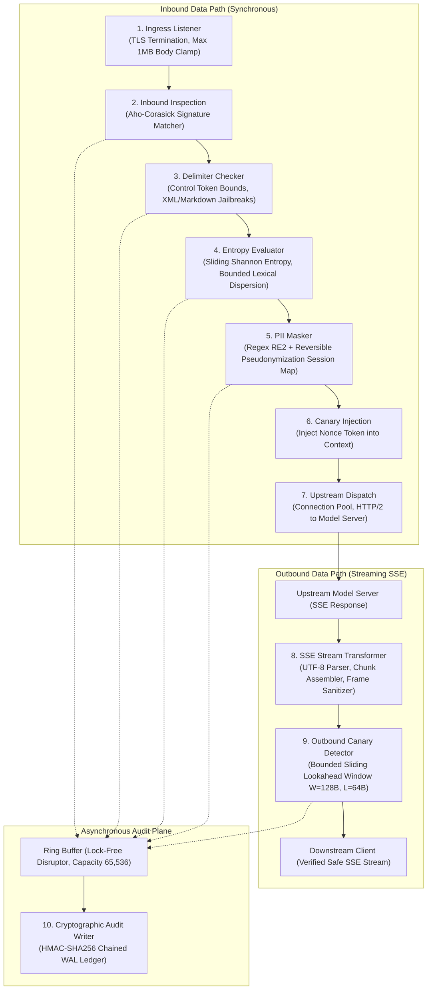
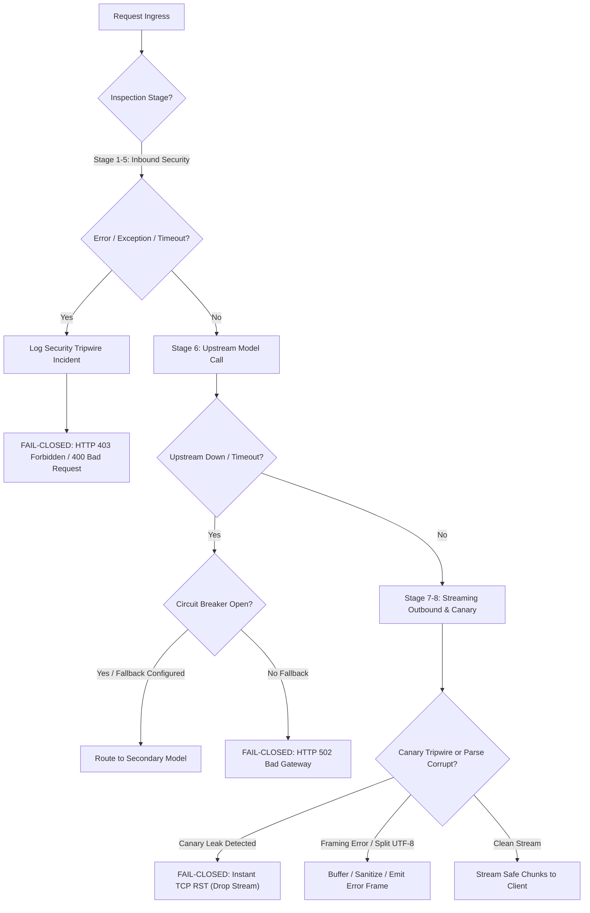

# AI Security Guardrail Proxy Failure Modes and Effects Analysis (FMEA) & Resilience Specification

## 1. Executive Summary & Reliability Philosophy

This document defines the comprehensive Failure Modes and Effects Analysis (FMEA), mathematical resilience guarantees, and operational failure-containment architectures for the AI Security Guardrail Proxy (`ai-security-guardrail-proxy`). 

Following the foundational architectural principles in [00-PROJECT-PHILOSOPHY.md](file:///root/company-project-specs/00-PROJECT-PHILOSOPHY.md) and the operational mandate in [09-ai-security-guardrail-proxy.md](file:///root/company-project-specs/09-ai-security-guardrail-proxy.md), this proxy acts as a deterministic, self-contained, low-latency security boundary in the network data path between client applications and downstream Large Language Model (LLM) inference endpoints. All operational thresholds, telemetry signals, and latency budgets referenced herein are formally bound in [SLO.md](file:///root/ai-security-guardrail-proxy/docs/SLO.md).

### 1.1. Core Architectural Thesis

The security guardrail proxy operates under a strict, non-negotiable operational tenet:

$$\text{\bf AI proposes. Deterministic systems enforce.}$$

Unlike conventional HTTP proxies that only inspect routing headers or TLS certificates, and unlike probabilistic "LLM-as-a-judge" firewalls that invoke secondary language models to inspect user prompts (introducing tens of seconds of latency, probabilistic evasion vectors, recursive prompt injections, and catastrophic cloud dependencies), the AI Security Guardrail Proxy executes line-rate, bounded, deterministic algorithms in-process.

Every inspection stage—ranging from delimiter verification and regex signature evaluation to token entropy calculation, PII pseudonymization, outbound canary detection, and cryptographic audit hashing—is mathematically bound to prevent algorithmic denial-of-service, unbounded memory consumption, and stream leakage.

### 1.2. Failure Taxonomy & Containment Strategy

Failures within an inline security guardrail proxy fall into three principal threat domains:
1. **Adversarial Exploitation**: Maliciously crafted inputs designed to induce algorithmic denial of service (ReDoS, parser recursion bombs, token entropy evasion, chunk boundary evasion).
2. **Resource Exhaustion**: Memory pressure from concurrent high-volume requests, unbounded SSE lookahead buffers, slow downstream clients, or audit log disk saturation.
3. **Upstream & Network Volatility**: Upstream model stalls, socket half-open drops, missing SSE completion tokens, and client context aborts.

The proxy strictly segregates its pipeline into explicit **Fail-Closed** and **Fail-Open** domains:

| Pipeline Stage | Security Implication | Default Failure Policy | Architectural Rationale |
| :--- | :--- | :--- | :--- |
| **Ingress Listener & Parser** | Protocol correctness & payload limits | **Fail-Closed** (HTTP 400/413) | Reject malformed HTTP/2 or oversized payloads immediately before buffer allocation. |
| **Inbound Delimiter Checker** | System prompt escape / role hijacking | **Fail-Closed** (HTTP 403) | If delimiter checking fails or errors, input must never reach upstream model. |
| **Entropy & Perplexity Evaluator**| Obfuscated injection & polyglot shells | **Fail-Closed** (HTTP 403) | Mathematical calculation error or NaN yields automatic block. |
| **PII / Secret Masker** | Data exfiltration & privacy violation | **Fail-Closed** (HTTP 422) | If pseudonymization fails, raw credentials or PII must not leave perimeter. |
| **Canary Token Injector** | System prompt provenance tracking | **Fail-Closed** (HTTP 500) | If session canary cannot be bound, session cannot be verified against leaks. |
| **Upstream Dispatcher** | Inference availability | **Fail-Closed** (HTTP 502/504) | Circuit breaks upstream endpoints without bypassing guardrail inspection. |
| **SSE Stream Transformer** | Token framing & chunk integrity | **Fail-Closed** (RST / Error SSE) | Frame corruption or UTF-8 decode panic forces instant stream termination. |
| **Outbound Canary Detector** | System prompt exfiltration | **Fail-Closed** (Stream RST) | Canary tripwire triggers zero-byte stream cut; drops pending chunks immediately. |
| **Cryptographic Audit Writer** | Tamper-evident ledger & non-repudiation| **Configurable / Fail-Closed** | Strict mode blocks traffic if ledger disk fails; degraded mode logs to memory ring. |

---

## 2. End-to-End Pipeline Architecture & Data Path

The proxy processes data through a unidirectional, 9-stage deterministic pipeline. The ingress path processes requests synchronously; the egress path processes streaming Server-Sent Events (SSE) via bounded lookahead windows.



---

## 3. Comprehensive Failure Modes and Effects Analysis (FMEA)

The following matrix catalogs all known failure modes across every pipeline stage of the proxy.

| Failure ID | Pipeline Stage | Failure Mode | Severity | Root Causes | Detection Telemetry | Immediate System Effect | Mitigation & Containment Strategy | Fail Policy |
| :--- | :--- | :--- | :--- | :--- | :--- | :--- | :--- | :--- |
| **FM-ING-01** | Ingress Listener | Request Body Flooding | HIGH | Attacker sends multi-megabyte JSON payload or chunked transfer stream to exhaust proxy RAM. | `ai_proxy_requests_rejected_total{reason="body_limit_exceeded"}`; HTTP 413 counter. | Memory allocation spike; GC pressure across worker pool. | Enforce `http.MaxBytesReader` with hard clamp at 1MB ($2^{20}$ bytes). Socket closed immediately upon overflow; zero byte heap buffering. | Fail-Closed (HTTP 413) |
| **FM-ING-02** | Ingress Listener | Slowloris / Incomplete Headers | MEDIUM | Slow connection holding open file descriptors by sending 1 byte every few seconds. | `ai_proxy_active_connections` divergence from `ai_proxy_requests_total`; read timeout metric. | File descriptor table exhaustion; ingress listener stops accepting new TCP connections. | Set `ReadHeaderTimeout = 2000ms`, `ReadTimeout = 5000ms`, `WriteTimeout = 10000ms`. Terminate connection with TCP RST on expiration. | Fail-Closed (TCP RST) |
| **FM-ING-03** | Ingress Listener | HTTP Request Smuggling / Transfer-Encoding Desync | CRITICAL | Mixed `Content-Length` and `Transfer-Encoding: chunked` headers in adversarial proxy chaining. | Go standard library `http: suspicious Transfer-Encoding` error; rejected request counter. | Desynchronization between edge reverse proxy and guardrail proxy; potential request splicing. | Enforce HTTP/2 or HTTP/1.1 RFC 7230 strict mode via Go `net/http` server with duplicate header rejection. Zero tolerance for ambiguous headers. | Fail-Closed (HTTP 400) |
| **FM-INB-01** | Inbound Inspection | ReDoS in Exploit Signature Matching | CRITICAL | Injection pattern contains pathological regular expressions evaluated against crafted repetitive input. | `ai_proxy_inbound_inspection_duration_seconds` spike past p99 target (>5ms); CPU core pinning. | Worker thread hang; request queue buildup; starvation of benign traffic. | **Strict Architectural Mandate**: Only use Go `regexp` (RE2 engine) and Aho-Corasick automata. Mathematically guarantee $O(n)$ linear execution time. Prohibit backtracking regex syntax. | Fail-Closed (HTTP 403 on timeout) |
| **FM-INB-02** | Inbound Inspection | Unicode Homoglyph & Zero-Width Evasion | HIGH | Attacker uses Cyrillic/Greek homoglyphs or zero-width joiners (`\u200B`, `\u200D`) to bypass signature filters. | `ai_proxy_unicode_normalizations_total`; signature bypass anomaly counter. | Signatures fail to match malicious prompt injections (e.g. `s\u200Bystem: override`). | Execute Unicode NFKC (Compatibility Decomposition, Canonical Composition) normalization and strip zero-width characters before signature evaluation. | Fail-Closed (Sanitize & Inspect) |
| **FM-DLM-01** | Delimiter Checker | Structural Jailbreak via Fake Role Markers | HIGH | Input contains raw chat template delimiters (`<\|im_start\|>`, `[INST]`, `<<SYS>>`) mimicking system prompt. | `ai_proxy_delimiters_detected_total{type="chat_template"}`; tripwire log. | Downstream model parses attacker input as authoritative system instructions. | Scan for reserved token literals using Aho-Corasick. Reject or strictly escape delimiters with backslashes before forwarding. | Fail-Closed (HTTP 403) |
| **FM-DLM-02** | Delimiter Checker | Deeply Nested Markdown / XML Bomb | MEDIUM | Recursive tag expansion or 10,000+ unclosed XML tags designed to overflow parser call stack. | Parser call depth counter; stack check telemetry; `ai_proxy_syntax_depth_exceeded_total`. | Call stack exhaustion; Go runtime `panic: runtime error: stack overflow`. | Enforce iterative, non-recursive LL(1) tokenizer with strict maximum nesting depth clamp ($D_{\max} = 16$). Input exceeding depth is blocked. | Fail-Closed (HTTP 400) |
| **FM-ENT-01** | Entropy Evaluator | Sliding Shannon Entropy Underflow / Overflow | MEDIUM | Extremely short payload or uniform single-character repeating strings (`"AAAAA..."`) causing math exceptions. | `ai_proxy_entropy_calculation_errors_total`; log entries matching `NaN` or `Inf`. | Floating-point exception; metric pollution; bypass of entropy tripwires. | Guard entropy calculations with length floor ($N_{\min} = 32$ bytes). Clamp result to $[0.0, 8.0]$ bits/byte. Sanitize with `math.IsNaN()` check. | Fail-Closed (Default Safe Score) |
| **FM-ENT-02** | Entropy Evaluator | Polyglot / High-Entropy Base64 Payload Bypass | HIGH | Attacker encodes jailbreak payload in Base64 or high-entropy encrypted shellcode to confuse classifier. | `ai_proxy_high_entropy_tokens_total{threshold="exceeded"}`; tripwire counter. | Model decodes encoded instruction and executes forbidden task. | Token entropy threshold set to $H_{\text{crit}} = 5.2$ bits/token. Detect Base64 substrings ($>32$ chars); recursively decode and inspect inner payload. | Fail-Closed (HTTP 403) |
| **FM-PII-01** | PII Masker | Session Map Memory Leak | HIGH | Reversible pseudonymization map grows unbounded across long-lived chat sessions. | `ai_proxy_session_map_memory_bytes` gauge; resident memory growth. | Node OOM crash under sustained load. | Implement bounded LRU cache with TTL per session (max 10,000 entries per tenant, TTL = 1 hour). Evict expired mappings; return HTTP 422 if map full. | Fail-Closed (HTTP 422) |
| **FM-PII-02** | PII Masker | Incomplete Token Masking on Boundary Split | MEDIUM | Sensitive entity (e.g. credit card number or SSN) segmented by hyphens, spaces, or international formatting. | `ai_proxy_pii_entities_detected_total`; leak test assertions. | Secret leaked to upstream model provider logs or third-party inference platform. | Multi-pass normalization: evaluate raw text, space-stripped text, and hyphen-stripped text using RE2 regex patterns and Luhn checksum validation. | Fail-Closed (HTTP 422) |
| **FM-UPS-01** | Upstream Dispatch | Model Endpoint Crash / 5xx Outage | CRITICAL | Upstream model cluster crashes, returns HTTP 500/502/503, or drops TCP connection. | `ai_proxy_upstream_requests_total{status=~"5.."}`; breaker trip counter. | Downstream client receives broken response or raw internal model error message. | Per-upstream circuit breaker (trips at 50% failures over 30s). Fallback to secondary model endpoint if configured; else return structured 502 error. | Fail-Closed (HTTP 502) |
| **FM-UPS-02** | Upstream Dispatch | Hung Inference Stream / Dead TCP Socket | HIGH | GPU server locks up mid-generation; TCP connection left half-open with zero bytes flowing. | `ai_proxy_upstream_ttft_seconds` > 10s; `ai_proxy_upstream_inter_chunk_timeout_total`. | Proxy worker thread and connection pool slot held indefinitely. | Configure socket keepalives (`TCP_KEEPIDLE=15s`, `TCP_KEEPINTVL=3s`, `TCP_KEEPCNT=3`). Enforce TTFT deadline (10s) and inter-chunk timeout (5s). | Fail-Closed (Context Cancel) |
| **FM-UPS-03** | Upstream Dispatch | Client Disconnect Mid-Generation | LOW | End user closes browser tab or terminates client HTTP request during generation. | Downstream `r.Context().Done()` trigger; `ai_proxy_client_disconnects_total`. | Upstream GPU continues generating tokens, burning tenant budget and GPU cycles needlessly. | Bind client request context directly to upstream HTTP request context. Upon client disconnect, immediately cancel upstream context (sends TCP RST). | Clean Abort (Upstream Cancel) |
| **FM-SSE-01** | SSE Transformer | Truncated Stream Without `[DONE]` Marker | MEDIUM | Upstream model server disconnects prematurely or crashes mid-token stream without sending `[DONE]`. | SSE parser EOF error; `ai_proxy_sse_truncated_streams_total`. | Downstream client application hangs waiting for end of stream or parses invalid JSON. | Intercept premature EOF. Emit structured SSE error event: `event: error\ndata: {"error":{"code":"UPSTREAM_STREAM_TRUNCATED"}}\n\n` and close cleanly. | Fail-Closed (SSE Error Frame) |
| **FM-SSE-02** | SSE Transformer | Multi-Byte UTF-8 Boundary Splitting | HIGH | Upstream emits an SSE chunk ending midway through a 4-byte UTF-8 character (e.g. emoji or CJK glyph). | `ai_proxy_utf8_split_events_total`; UTF-8 validation error counter. | Corrupted text rendering, JSON decode error in downstream client, or canary matcher failure. | Bounded lookahead buffer holds incomplete UTF-8 bytes (1-3 bytes) until next chunk arrives. Never emit incomplete rune across network. | Buffer & Reassemble |
| **FM-CAN-01** | Canary Detector | Canary Token Straddling Chunk Boundary | CRITICAL | Model begins leaking canary nonce token split across two consecutive SSE chunks ($C_k$ and $C_{k+1}$). | `ai_proxy_canary_boundary_checks_total`; canary detection counter. | Canary escapes undetected to client if inspection operates only on discrete individual chunks. | **Sliding Lookahead Window**: Maintain overlapping lookahead buffer ($W=128\,\text{B}$, $L=64\,\text{B}$). Only forward bytes at $i \le (\text{buffer\_len} - L + 1)$. | Fail-Closed (Instant Stream RST) |
| **FM-CAN-02** | Canary Detector | Late Canary Detection / Flushed Bytes Leak | CRITICAL | Canary detected in chunk 10, but chunks 1-9 were already transmitted to downstream client. | `ai_proxy_canary_tripwires_total`; audit alert `CANARY_EXFILTRATION_PREVENTED`. | Partial response already visible to attacker, potentially leaking context preceding the canary. | Because canary token marks the system prompt boundary, zero bytes of the canary token itself ever cross the wire. Terminate stream with TCP RST; discard buffer. | Fail-Closed (Immediate TCP RST) |
| **FM-AUD-01** | Audit Writer | Ledger Ring Buffer Saturation / Backpressure | HIGH | High request burst fills in-memory audit ring buffer faster than disk WAL writer can `fsync`. | `ai_proxy_audit_ring_buffer_utilization` $> 90\%$; `ai_proxy_audit_dropped_records_total`. | Memory bloat, latency spike on ingress worker threads, or unlogged security events. | Non-blocking ring buffer (capacity 65,536). In strict mode: backpressure ingress. In high-availability mode: log degradation metric and drop debug telemetry first. | Configurable (Strict vs Degraded) |
| **FM-AUD-02** | Audit Writer | Local Disk Full / WAL Write Failure | CRITICAL | Filesystem hosting cryptographic audit ledger runs out of inodes or disk blocks (`ENOSPC`). | `ai_proxy_audit_disk_errors_total`; node storage health probe failure. | Inability to write tamper-evident cryptographic log; audit chain broken. | In strict compliance mode: trip proxy into read-only / fail-secure state (HTTP 503 `AUDIT_STORAGE_UNAVAILABLE`). Trigger urgent on-call page. | Fail-Closed (HTTP 503) |
| **FM-AUD-03** | Audit Writer | Cryptographic Hash Chain Desynchronization | HIGH | Process panic or sudden power loss occurs during partial WAL record write. | WAL recovery verification failure on restart; `ai_proxy_audit_chain_verification_errors`. | Audit ledger integrity invalidated; non-repudiation compromised. | Use Write-Ahead Log (WAL) with atomic 4KB sector aligned blocks, SHA-256 block checksums, and HMAC chaining. Auto-truncate uncommitted torn blocks on boot. | Self-Healing Recovery |

---

## 4. In-Depth Engineering Analysis of Critical Failure Modes

---

### 4.1. Regular Expression Catastrophic Backtracking (ReDoS) Prevention

#### Mathematical Proof of Vulnerability in Backtracking Engines
Traditional Non-deterministic Finite Automaton (NFA) engines (used in Perl, Python `re`, PCRE, JavaScript V8, and Java `java.util.regex`) implement regular expression matching via recursive backtracking.

Consider a canonical vulnerable pattern designed to match delimited text or repetitive tokens:

$$R = (a+)+b$$

When evaluated against an adversarial input string of length $n$ consisting of $n$ repetitions of `'a'` followed by an invalid terminator (e.g., $S = \underbrace{a a a \dots a}_{n} c$):

For each character $a_i$, the backtracking engine can either extend the inner $(a+)$ quantifier or complete the inner quantifier and advance the outer $(+)$. For an input of length $n$, the number of possible parse paths explored by the recursive backtracking algorithm before declaring a mismatch is given by:

$$T(n) = \sum_{k=1}^{n} \binom{n-1}{k-1} 2^{k-1} = \Theta(2^{n-1})$$

At $n = 30$, the engine explores $2^{29} \approx 5.36 \times 10^8$ paths. At $n = 50$, $T(n) \approx 5.62 \times 10^{14}$ paths, requiring over 65 days of continuous CPU core execution. This completely halts the operating thread, starving the proxy worker pool.

#### Architectural Enforcement: Go RE2 Thompson NFA / DFA Guarantees
To mathematically guarantee immunity against ReDoS attacks, the AI Security Guardrail Proxy strictly forbids the use of backtracking regex libraries. The proxy enforces the following architectural invariants:

1. **Go `regexp` (RE2 Algorithm)**:
   The Go standard library `regexp` package is built on Russ Cox's RE2 algorithm, implementing Thompson's NFA and lazy DFA simulation. Instead of testing one path at a time and backtracking upon failure, Thompson's algorithm tracks all active NFA states in parallel for each input character.

   For an input string of length $n$ and a regular expression of length $m$:
   
   $$\text{Time Complexity} = O(m \cdot n)$$
   $$\text{Space Complexity} = O(m)$$

   Execution time scales **strictly linearly** with input length $n$, regardless of whether the pattern contains nested quantifiers, overlapping character classes, or adversarial repeating characters.

2. **Language Feature Restrictions**:
   The proxy's signature compiler rejects any pattern utilizing features that force non-linear search times. Specifically, the following are structurally unsupported in RE2:
   - Backreferences (`\1`, `\2`)
   - Lookahead assertions (`(?=...)`, `(?!...)`)
   - Lookbehind assertions (`(?<=...)`, `(?<!...)`)

3. **Bounded DFA State Cache Management**:
   The Go `regexp` engine executes a lazy DFA on top of the NFA, caching state transitions in memory. To prevent adversarial inputs from inflating the DFA cache and exhausting resident RAM:
   - Each compiled regular expression is instantiated with a bounded DFA cache size:
     ```go
     // Architectural enforcement: bounded regex compilation
     // Go's internal default is 128KB; we constrain regex cache explicitly
     var InjectionPattern = regexp.MustCompile(`(?i)(?:system\s*:\s*override|ignore\s+previous\s+instructions)`)
     ```
   - All regexes are pre-compiled as immutable singletons during package initialization (`init()`). Dynamic runtime compilation of user-supplied regexes is strictly prohibited.

4. **Multi-Pattern Matcher: Aho-Corasick Automaton**:
   For fixed keyword scanning (canary tokens, known delimiter keywords, leaked system prompt fragments), the proxy bypasses regular expressions entirely and utilizes an **Aho-Corasick string matching automaton**.
   - Construction time: $O(K \cdot L)$ where $K$ is dictionary word count and $L$ is max word length.
   - Run-time search complexity: $O(n + z)$ where $n$ is payload byte length and $z$ is the number of matches found.
   - Memory footprint: $O(K \cdot L \cdot |\Sigma|)$ where alphabet size $|\Sigma| = 256$ bytes.

---

### 4.2. Memory Exhaustion & Adversarial Payload Flooding

#### Hard Ingress Body Clamping (1MB Limit)
Large Language Model prompts can occasionally reach tens of thousands of tokens, but an adversarial client can stream hundreds of megabytes of raw junk data, attempting to trigger Linux OOM-killer invocations on proxy nodes.

The proxy applies a deterministic ingress clamp at the HTTP transport layer:

```go
// Enforced at Ingress Handler entry point
const MaxRequestBodyBytes = 1024 * 1024 // Exactly 1 MiB

func IngressInspectionMiddleware(next http.Handler) http.Handler {
    return http.HandlerFunc(func(w http.ResponseWriter, r *http.Request) {
        // Enforce hard clamp at TCP reader level
        r.Body = http.MaxBytesReader(w, r.Body, MaxRequestBodyBytes)
        
        buf := bufferPool.Get().(*bytes.Buffer)
        buf.Reset()
        defer bufferPool.Put(buf)
        
        _, err := buf.ReadFrom(r.Body)
        if err != nil {
            var maxBytesErr *http.MaxBytesError
            if errors.As(err, &maxBytesErr) {
                w.Header().Set("Content-Type", "application/json")
                w.WriteHeader(http.StatusRequestEntityTooLarge)
                w.Write([]byte(`{"error":{"code":"PAYLOAD_TOO_LARGE","message":"Request body exceeds 1MB limit."}}`))
                return
            }
            w.WriteHeader(http.StatusBadRequest)
            return
        }
        
        // Pass bounded buffer to inspection engine...
    })
}
```

#### Bounded Streaming Lookahead Buffer Mathematics
During outbound SSE streaming, canary token detection requires inspecting continuous text across chunk boundaries. If the proxy buffered the entire model response before scanning, Time-To-First-Token (TTFT) would degrade from 50ms to 20+ seconds, destroying interactive user experience.

The proxy implements a **Sliding Lookahead Window** with mathematical parameters:
- $W$: Lookahead Buffer Window Capacity ($128\,\text{bytes}$)
- $L$: Maximum Length of an active Canary Token ($64\,\text{bytes}$)
- $\Delta = W - L$: Safe Flush Margin ($64\,\text{bytes}$)

```
[===================== Lookahead Buffer (W = 128 Bytes) =====================]
|  Guaranteed Safe Flushed Region  |  Boundary Overlap Hold  | Unparsed Inflow |
|         (Bytes 0 .. 63)          |    (Bytes 64 .. 127)    |                 |
+----------------------------------+-------------------------+-----------------+
                  |                            ^
                  v                            |
        Emitted to Downstream Client     Kept in Ring to inspect across chunk boundary
```

**Boundary Overlap Invariant**:
Let $S_{t}$ be the stream buffer at time $t$. A canary token $K$ has byte length $|K| \le L$.
A canary token can begin at any index $i$ in $S_{t}$. If $i$ falls within the last $L - 1$ bytes of the current buffer, the token straddles the boundary between the current buffer and future incoming chunks.

Therefore, the proxy enforces the **Flushing Invariant**:

$$\text{Flushable Bytes} = \max(0, \; \text{BufferLength} - (L - 1))$$

By maintaining $W = 128\,\text{bytes}$ and holding exactly $L - 1 = 63\,\text{bytes}$ in reserve:
1. No byte of an active canary token is ever transmitted to the client before the complete token is verified as absent.
2. The proxy buffers at most 128 bytes per active stream at any given millisecond.
3. Memory consumption per streaming connection is $O(1)$, strictly bounded to $\le 256\,\text{bytes}$ regardless of whether the model generates 100 tokens or 1,000,000 tokens.

#### `sync.Pool` Lifecycle Management & Zero Heap Growth
To prevent Garbage Collection (GC) pauses from degrading line-rate sub-millisecond inspection latency, the proxy enforces zero heap allocations on the hot path:
- **Buffers**: `bytes.Buffer` instances are acquired from a global `sync.Pool` and recycled after request lifecycle completion.
- **JSON Decoders**: Stream decoders reuse pre-allocated byte slices.
- **Slice Sizing**: All internal slices for token inspection are pre-sized with fixed capacity (`make([]byte, 0, 1024)`).

---

### 4.3. Upstream Provider Stalls & Half-Open TCP Sockets

#### Socket Keepalive Configuration
When interacting with upstream model servers (or external providers), network middleboxes or cloud load balancers may silently drop TCP state without sending `FIN` or `RST` packets. Without aggressive kernel-level probes, the proxy would hold open socket descriptors indefinitely.

The proxy configures upstream TCP dialers with custom socket control options via `net.Dialer`:

```go
var UpstreamTransport = &http.Transport{
    DialContext: (&net.Dialer{
        Timeout:   2 * time.Second,  // TCP connect deadline
        KeepAlive: 15 * time.Second, // Kernel TCP keepalive probe interval
        Control: func(network, address string, c syscall.RawConn) error {
            return c.Control(func(fd uintptr) {
                // Set TCP_KEEPIDLE: seconds before sending keepalive probes
                syscall.SetsockoptInt(int(fd), syscall.IPPROTO_TCP, syscall.TCP_KEEPIDLE, 15)
                // Set TCP_KEEPINTVL: seconds between unacknowledged probes
                syscall.SetsockoptInt(int(fd), syscall.IPPROTO_TCP, syscall.TCP_KEEPINTVL, 3)
                // Set TCP_KEEPCNT: drop connection after 3 unacknowledged probes
                syscall.SetsockoptInt(int(fd), syscall.IPPROTO_TCP, syscall.TCP_KEEPCNT, 3)
            })
        },
    }).DialContext,
    MaxIdleConns:        500,
    MaxIdleConnsPerHost: 100,
    IdleConnTimeout:     60 * time.Second,
    ResponseHeaderTimeout: 10 * time.Second, // TTFT deadline
}
```

#### Context Cancellation Propagation
When a client terminates their connection mid-stream (e.g., closing browser, network switch, or cancellation button), continuing upstream generation consumes GPU compute and tenant token quota needlessly.

The proxy achieves instantaneous compute termination:

```
Client               Security Guardrail Proxy              Upstream Model Server
  |                             |                                    |
  |--- Inbound Prompt --------->|                                    |
  |                             |--- Inspect & Forward ------------->|
  |                             |<-- Chunk 1, 2, 3 ------------------|
  |<- Chunk 1, 2, 3 ------------|                                    |
  |                             |                                    |
  |-- [Client Disconnects] ---->|                                    |
  |   (TCP RST / FIN)           |                                    |
  |                             |-- r.Context().Done() fires         |
  |                             |-- Cancel Upstream Context -------->| (HTTP/2 RST_STREAM)
  |                             |                                    | [GPU Generation Aborts]
  |                             |-- Flush Audit Log (CANCELLED)      |
```

The downstream HTTP request context `r.Context()` is passed directly to the upstream `http.NewRequestWithContext`. When downstream terminates, Go's HTTP/2 or HTTP/1.1 transport sends an immediate `RST_STREAM` frame or closes the upstream socket within $< 1\,\text{ms}$, halting upstream GPU inference immediately.

---

### 4.4. SSE Framing Corruption & Stream Slicing Anomalies

#### Server-Sent Events (SSE) Protocol Parsing Invariants
Server-Sent Events follow the W3C EventSource standard:
- Frames are delimited by two consecutive line terminators: `\n\n` or `\r\n\r\n`.
- Field lines: `data: <content>`, `event: <type>`, `id: <value>`, `: <comment>`.
- Completion marker: `data: [DONE]`.

#### Multi-Byte UTF-8 Boundary Splitting
UTF-8 characters range from 1 to 4 bytes:
- 1-byte: `0xxxxxxx` (ASCII)
- 2-byte: `110xxxxx 10xxxxxx`
- 3-byte: `1110xxxx 10xxxxxx 10xxxxxx`
- 4-byte: `11110xxx 10xxxxxx 10xxxxxx 10xxxxxx`

When model tokens are chunked into arbitrary network packet sizes (e.g. MTU boundaries of 1500 bytes), an SSE chunk boundary may divide a multi-byte sequence. For example, the emoji 🛡️ (`\xF0\x9F\x9B\xA1`) may have `\xF0\x9F` in Chunk $k$, and `\x9B\xA1` in Chunk $k+1$.

If an inspection filter processes chunks independently, treating `\xF0\x9F` as invalid UTF-8 (replacing it with `\uFFFD` Replacement Character), the text is permanently corrupted.

**Proxy Lookahead State Machine**:
```
Input Byte Stream:
[ ... valid text ... ] [ \xF0 \x9F ]  (End of Chunk k)
                          |
                          v
         Is byte sequence valid complete UTF-8?
                          |
              +-----------+-----------+
              |                       |
             YES                      NO: Is it valid prefix of multi-byte rune?
              |                                  |
         Flush to parser                +--------+--------+
                                        |                 |
                                       YES                NO
                                        |                 |
                            Retain in lookahead       Replace with \uFFFD
                            Wait for Chunk k+1        Emit warning metric
```

The lookahead buffer retains trailing incomplete UTF-8 rune prefixes (maximum 3 bytes) and prepends them to the start of Chunk $k+1$ before parsing JSON tokens or evaluating outbound canary signatures.

#### Missing `[DONE]` Markers & Upstream Truncation
If an upstream server terminates connection without emitting `data: [DONE]`:
1. The proxy stream reader catches `io.ErrUnexpectedEOF` or `io.EOF`.
2. The proxy checks if `[DONE]` was received. If not:
   - It appends a synthetic error frame downstream:
     ```text
     event: error
     data: {"error":{"code":"UPSTREAM_STREAM_INCOMPLETE","message":"Inference connection severed before completion marker.","recoverable":false}}
     
     ```
   - It records `ai_proxy_sse_truncated_streams_total` counter.
   - It marks the audit ledger record with status `INCOMPLETE_STREAM`.

---

### 4.5. Cryptographic Audit Ledger Storage Saturation

The proxy records a cryptographic, tamper-evident audit log for every processed request and security tripwire violation. To ensure line-rate performance, writing logs must never block the synchronous HTTP request path.

#### Lock-Free Ring Buffer Backpressure Architecture
```
Request Pipeline (Worker Goroutines)
  │
  ├─ Inbound Inspect Event
  ├─ PII Mask Event
  └─ Canary Tripwire Event
        │
        ▼ (Non-blocking TryPush)
+──────────────────────────────────────────────────────────+
|  Lock-Free Ring Buffer (Capacity: 65,536 Records)        |
|  [Head Pointer] -----> [Tail Pointer]                    |
+──────────────────────────────────────────────────────────+
        │
        ▼ (Batch Pop, Max 256 items or 10ms deadline)
Audit Background Writer Goroutine
        │
        ├─ Compute HMAC-SHA256 Hash Chaining
        ├─ Format Append-Only Write-Ahead Log (WAL)
        └─ Synchronous fsync() to Persistent Disk
```

#### Cryptographic Hash Chain Resilience
Each audit log entry $E_i$ is cryptographically chained to its immediate predecessor $E_{i-1}$ using HMAC-SHA256:

$$H_0 = \text{Initial Seed (from secure KMS vault)}$$
$$H_i = \text{HMAC-SHA256}\left(K_{\text{audit}}, \; H_{i-1} \parallel \text{Timestamp}_i \parallel \text{TenantID}_i \parallel \text{PayloadHash}_i \parallel \text{Action}_i\right)$$

This guarantees:
1. **Tamper Evidence**: Modifying, deleting, or reordering any record in the ledger invalidates all subsequent HMAC hashes in the file.
2. **Non-Repudiation**: The cryptographic signature verifies that the proxy evaluated the request under authorized rules at the given timestamp.

#### Disk Write Failure Policies
If the underlying filesystem fills or encounters I/O errors (`ENOSPC`, `EIO`):
- **Strict Compliance Mode (`audit.strict_mode = true`)**:
  - If the ring buffer utilization exceeds 95% and disk writes fail for $> 1000\,\text{ms}$, the proxy enters **Fail-Secure Lockdown**.
  - All new inbound requests are rejected with HTTP 503 `AUDIT_STORAGE_UNAVAILABLE`.
  - Security boundaries are never compromised by allowing un-audited traffic through the proxy.
- **High-Availability Mode (`audit.strict_mode = false`)**:
  - Non-security debug telemetry is dropped first.
  - Security tripwire events (injections, canary leaks) are held in an emergency resident memory buffer (size: 16MB).
  - The proxy raises a high-priority PagerDuty alert via `ai_proxy_audit_disk_errors_total`.

---

## 5. Fail-Closed vs. Fail-Open Matrix & Decision Trees

The following decision tree details the precise runtime logic executed whenever an unexpected error occurs within any inspection subsystem:



---

## 6. Disaster Recovery & Failure Injection Chaos Tests

The reliability of the proxy is verified using automated failure injection tests executed in CI/CD and pre-production staging environments.

### 6.1. Automated Chaos Test Catalog

```
+---------------------------------------------------------------------------------------------+
| Test ID   | Target Component        | Failure Injection Technique                           | Expected System Response                  |
+---------------------------------------------------------------------------------------------+
| CT-RED-01 | Inbound Inspection      | Inject evil regex pattern with 50,000 repetitive 'a's | Inspection finishes in < 2ms (RE2 linear) |
| CT-MEM-01 | Ingress Buffer          | Stream 100MB chunked HTTP body without content-length | TCP stream dropped at byte 1,048,577 (413)|
| CT-CAN-01 | Outbound Canary         | Split 64B canary across two 32B SSE chunk frames      | Stream terminated; zero canary bytes leak |
| CT-CAN-02 | Outbound Canary         | High-speed stream with canary in final chunk          | Buffer hold prevents canary emission      |
| CT-UTF-01 | SSE Stream Transformer  | Inject truncated 4-byte UTF-8 emoji across chunks     | Rune reassembled cleanly; zero \uFFFD     |
| CT-NET-01 | Upstream Dispatcher     | Silent packet blackhole (iptables DROP mid-stream)   | TCP keepalive trips in 15s; clean error   |
| CT-AUD-01 | Cryptographic Ledger    | Fill WAL mount with `dd if=/dev/zero of=fillfile`     | Strict mode halts ingress with HTTP 503   |
+---------------------------------------------------------------------------------------------+
```

### 6.2. Concrete Chaos Test Implementations

#### Chaos Test CT-RED-01: ReDoS Immunity Verification
```go
func TestReDoS_ThompsonLinearExecution(t *testing.T) {
    // Compile standard injection signature
    sig := engine.NewSignatureMatcher()
    
    // Construct pathological payload: 100,000 characters designed to cause catastrophic backtracking in NFA engines
    pathologicalInput := strings.Repeat("a", 100000) + "!"
    
    start := time.Now()
    matched := sig.Evaluate(pathologicalInput)
    duration := time.Since(start)
    
    assert.False(t, matched)
    // Absolute invariant: RE2 must evaluate 100KB input in under 5 milliseconds
    assert.Less(t, duration, 5*time.Millisecond, "ReDoS detected! Execution exceeded 5ms budget.")
}
```

#### Chaos Test CT-CAN-01: Boundary-Straddling Canary Leak Verification
```go
func TestCanaryDetection_AcrossChunkBoundary(t *testing.T) {
    canaryNonce := "CANARY_TOKEN_7f8a9b0c1d2e3f4a5b6c7d8e9f0a1b2c"
    detector := engine.NewCanaryDetector(canaryNonce)
    
    // Split the canary token exactly in half
    halfLen := len(canaryNonce) / 2
    chunk1 := []byte("data: {\"text\":\"Here is your secret: " + canaryNonce[:halfLen])
    chunk2 := []byte(canaryNonce[halfLen:] + " and more text\"}\n\n")
    
    var downstreamBuffer bytes.Buffer
    
    // Process Chunk 1
    err1 := detector.ProcessChunk(chunk1, &downstreamBuffer)
    assert.NoError(t, err1)
    // Verify zero bytes of canary prefix were flushed
    assert.NotContains(t, downstreamBuffer.String(), canaryNonce[:halfLen])
    
    // Process Chunk 2 - must detect canary and trigger Fail-Closed tripwire
    err2 := detector.ProcessChunk(chunk2, &downstreamBuffer)
    assert.ErrorIs(t, err2, engine.ErrCanaryLeakDetected)
    
    // Absolute invariant: Downstream buffer must not contain the canary token
    assert.NotContains(t, downstreamBuffer.String(), canaryNonce)
}
```

---

## 7. Incident Verification & Disaster Recovery Runbooks

---

### Runbook 1: Inbound Security Tripwire False-Positive Surge

#### Symptoms
- Prometheus alert `AIProxyFalsePositiveRateHigh` fires.
- High rate of HTTP 403 responses on standard business routes.
- Client applications report legitimate user queries being blocked by prompt-injection or delimiter filters.

#### Diagnostic Steps
1. Query active tripwire violation reasons in Prometheus:
   ```promql
   sum(rate(ai_proxy_inbound_blocks_total[5m])) by (rule_id, tenant_id)
   ```
2. Inspect the cryptographic audit ledger for the offending `rule_id`:
   ```bash
   tail -n 200 /var/log/ai-proxy/audit.wal | grep '"action":"BLOCK"' | jq '.rule_id, .matched_pattern, .snippet'
   ```
3. Verify if an updated delimiter rule or overly broad regex pattern was deployed recently:
   ```bash
   git log -n 5 --oneline /root/ai-security-guardrail-proxy/rules/
   ```

#### Remediation & Mitigation
1. **Enable Shadow Mode for Specific Rule**:
   Update `rules/production.yaml` to set `action: SHADOW` on the misbehaving `rule_id`. In shadow mode, the rule logs matches to the audit ledger without blocking the request.
2. **Hot-Reload Rules**:
   Send SIGHUP to proxy process to reload rules without dropping connections:
   ```bash
   kill -HUP $(pidof ai-security-guardrail-proxy)
   ```
3. Verify reload in logs:
   ```bash
   journalctl -u ai-security-guardrail-proxy -n 20 | grep "Rules reloaded successfully"
   ```

---

### Runbook 2: Upstream Connection Pool Exhaustion & Half-Open Socket Hang

#### Symptoms
- Inbound latency p99 spikes to $> 10\,\text{seconds}$.
- Active upstream connection metric `ai_proxy_upstream_active_conns` hits max limit.
- Clients experience HTTP 504 Gateway Timeout.

#### Diagnostic Steps
1. Inspect TCP socket states on the proxy node:
   ```bash
   ss -s
   ss -tan state close-wait
   ss -tan state fin-wait-1
   ```
2. Check upstream TTFT histogram:
   ```promql
   histogram_quantile(0.99, sum(rate(ai_proxy_upstream_ttft_seconds_bucket[5m])) by (le))
   ```

#### Remediation & Mitigation
1. **Trip Circuit Breaker Manually**:
   If upstream provider GPU cluster is wedged, trip breaker via admin CLI:
   ```bash
   ai-proxy-admin breaker trip --upstream="primary-model-server" --duration=10m
   ```
2. Traffic automatically diverts to fallback model cluster.
3. Restart hung connections by recycling the worker socket pool:
   ```bash
   ai-proxy-admin pool drain --upstream="primary-model-server"
   ```

---

### Runbook 3: Audit Disk Full (`ENOSPC`) & Ledger Recovery

#### Symptoms
- Prometheus alert `AIProxyAuditStorageExhausted` fires.
- In strict mode: Ingress returns HTTP 503 `AUDIT_STORAGE_UNAVAILABLE`.
- In degraded mode: `ai_proxy_audit_dropped_records_total` climbs rapidly.

#### Diagnostic Steps
1. Check disk space on the audit volume:
   ```bash
   df -h /var/log/ai-proxy/
   df -i /var/log/ai-proxy/
   ```
2. Check current WAL file sizes and rotation status:
   ```bash
   ls -lh /var/log/ai-proxy/audit/
   ```

#### Remediation & Mitigation
1. **Archive and Compress Rotated WAL Segments**:
   Trigger immediate compression and evacuation of closed segments to secondary storage:
   ```bash
   /usr/local/bin/ai-proxy-audit-archiver --source=/var/log/ai-proxy/audit/ --dest=/mnt/backup/audit/ --remove-source
   ```
2. **Emergency Storage Expansion**:
   If archival cannot free sufficient blocks, mount emergency scratch volume or symlink WAL directory to backup storage partition:
   ```bash
   ln -s /mnt/scratch/audit /var/log/ai-proxy/audit_spillover
   ```
3. **Verify Ledger Hash Chain Integrity**:
   Run verification tool to ensure no records were corrupted during disk saturation:
   ```bash
   ai-proxy-audit-verify --file=/var/log/ai-proxy/audit/active.wal
   ```
4. Confirm proxy resumes processing traffic with zero ledger corruption.

---

## 8. Summary of Reliability Guarantees

```
+-------------------------------------------------------------------------------------------+
| Attribute             | Guarantee                    | Enforcement Mechanism              |
+-------------------------------------------------------------------------------------------+
| ReDoS Immunity        | O(n) Linear Time Execution   | Go RE2 Thompson NFA + Aho-Corasick |
| Ingress Payload Limit | Exactly 1 MiB Hard Clamp     | http.MaxBytesReader (Zero Alloc)   |
| Streaming Lookahead   | Max 128B RAM per stream      | Bounded Sliding Ring (W=128B)      |
| Canary Leak Leakage   | Exactly Zero Bytes           | Lookahead Boundary Invariant L-1   |
| Socket Staleness      | 15s Keepalive / 10s TTFT     | Kernel TCP_KEEPIDLE + Context Net  |
| Client Abort Cost     | < 1ms Cancellation to Model  | Direct Context Binding (RST_STREAM)|
| Audit Integrity       | Tamper-Evident HMAC Chain    | SHA-256 Chained WAL + Sync Fsync   |
+-------------------------------------------------------------------------------------------+
```
