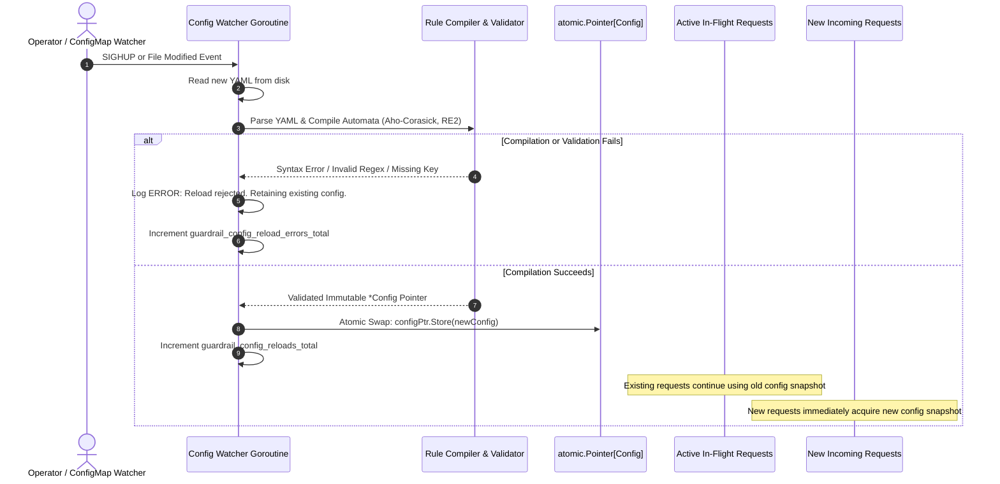
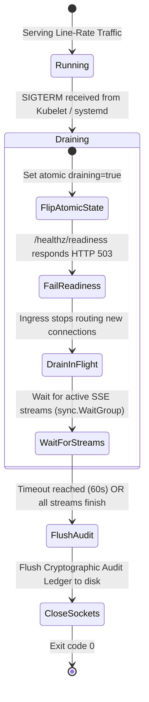

# AI Security Guardrail Proxy: Operations, Deployment & Runbook Manual

## 1. Overview & Operational Invariants

This manual defines the deployment architecture, configuration management, runtime lifecycle, telemetry, and incident response procedures for the AI Security Guardrail Proxy (`guardrail-proxy`). Compliant with `/root/company-project-specs/00-PROJECT-PHILOSOPHY.md` and `/root/company-project-specs/09-ai-security-guardrail-proxy.md`, this proxy provides deterministic, line-rate security enforcement directly in the network data path.

### 1.1 Core Operational Invariants

The proxy operates under four fundamental operational invariants that dictate all maintenance, deployment, and troubleshooting actions:

1. **Zero External Daemon Dependencies**:
   The proxy runs as an autonomous, self-contained single binary. It requires **no Redis, no PostgreSQL, no etcd, and no cloud-hosted security SaaS**. All rate-limiting buckets, session-scoped pseudonymization vaults, canary registries, and linear inspection automata execute strictly in-process in memory. If the local network experiences partitions or external services fail, the proxy continues inspecting and protecting model traffic uninterrupted.

2. **Deterministic Enforcement Over Probabilistic Scoring**:
   Security decisions (blocks, redactions, tripwire abortions) are enforced via linear-time regular expressions (RE2), Aho-Corasick multi-pattern search, token entropy thresholds, and structural JSON/delimiter parsers. No probabilistic "LLM-as-a-judge" or machine learning classifier executes in the critical data path. Security rules execute in guaranteed $O(n)$ time relative to payload size.

3. **Deterministic Fail-Closed Default Posture**:
   If an inspection stage panics, exhausts its allocated compute deadline, encounters an unparseable payload, or detects a canary token in outbound traffic, the proxy immediately terminates the request and severs the downstream TCP connection. Individual inspection filters may be temporarily configured for gated fail-open operation during documented incidents only via authenticated runtime configuration updates.

4. **Zero Byte Leakage on Streaming Tripwire**:
   During Server-Sent Events (SSE) streaming inspection, output chunks are evaluated through a sliding lookahead window ($W = 128\text{ bytes}$, $L = 64\text{ bytes}$). If an outbound tripwire (such as canary leakage, private key exfiltration, or PII) triggers, the proxy terminates the stream, executes an immediate TCP reset or connection close, and ensures zero trailing sensitive bytes reach the client.

---

## 2. Deployment Topologies

### 2.1 Single Static Binary (`FROM scratch`)

The proxy compiles into a single, fully static ELF binary with zero dynamic library linkages (`CGO_ENABLED=0`). The production container is packaged `FROM scratch` containing only the executable, an unprivileged user definition, CA certificates for upstream TLS verification, and embedded default rules compiled directly into the binary via Go `embed.FS`.

#### Minimal Dockerfile (`Dockerfile.production`)

```dockerfile
# Build stage
FROM golang:1.23-alpine AS builder
WORKDIR /src
RUN apk add --no-cache ca-certificates git

COPY go.mod go.sum ./
RUN go mod download

COPY . .
RUN CGO_ENABLED=0 GOOS=linux GOARCH=amd64 go build \
    -trimpath \
    -ldflags="-s -w -X 'main.Version=1.0.0' -X 'main.BuildTime=$(date -u +%FT%TZ)' -extldflags '-static'" \
    -o /bin/guardrail-proxy ./cmd/guardrail-proxy

# Final production image: true zero-dependency scratch container
FROM scratch
COPY --from=builder /etc/ssl/certs/ca-certificates.crt /etc/ssl/certs/
COPY --from=builder /bin/guardrail-proxy /guardrail-proxy

# System configuration and unprivileged user (UID 10001)
USER 10001:10001

EXPOSE 8080 9090
ENTRYPOINT ["/guardrail-proxy"]
CMD ["--config=/etc/guardrail-proxy/config.yaml"]
```

---

### 2.2 Host & Kernel Operating System Tuning

For bare-metal, edge appliance, or virtual machine deployments processing high-concurrency LLM traffic (tens of thousands of concurrent SSE streams), configure the Linux kernel socket and memory parameters via `/etc/sysctl.d/99-guardrail-proxy.conf`:

```ini
# Maximum socket listen backlog for burst connections
net.core.somaxconn = 65535
net.ipv4.tcp_max_syn_backlog = 65535

# Ephemeral port range expansion for outbound upstream model connections
net.ipv4.ip_local_port_range = 1024 65535

# TCP socket reuse and rapid recycling
net.ipv4.tcp_tw_reuse = 1
net.ipv4.tcp_fin_timeout = 15

# TCP buffer tuning (4KB min, 87KB default, 16MB max)
net.ipv4.tcp_rmem = 4096 87380 16777216
net.ipv4.tcp_wmem = 4096 65536 16777216

# Max queued packets on incoming network interface
net.core.netdev_max_backlog = 16384

# Virtual memory: prevent aggressive paging under sustained memory pressure
vm.swappiness = 10
vm.overcommit_memory = 1
```

Apply immediately with:
```bash
sysctl --system
```

---

### 2.3 systemd Production Service Unit

For Linux system deployments without Kubernetes, use the hardened systemd unit file at `/etc/systemd/system/guardrail-proxy.service`:

```ini
[Unit]
Description=AI Security Guardrail Proxy Service
Documentation=file:///root/ai-security-guardrail-proxy/docs/OPERATIONS.md
After=network-online.target
Wants=network-online.target

[Service]
Type=simple
User=guardrail-proxy
Group=guardrail-proxy
WorkingDirectory=/var/lib/guardrail-proxy
ExecStart=/usr/local/bin/guardrail-proxy --config=/etc/guardrail-proxy/config.yaml
ExecReload=/bin/kill -HUP $MAINPID
KillMode=process
KillSignal=SIGTERM
TimeoutStopSec=75s
Restart=always
RestartSec=3s

# File descriptor & process limits for 50,000 concurrent streaming connections
LimitNOFILE=65536
LimitNPROC=32768
LimitMEMLOCK=infinity

# Linux Security Hardening Directives
ProtectSystem=strict
ProtectHome=yes
ProtectKernelTunables=yes
ProtectKernelModules=yes
ProtectControlGroups=yes
PrivateTmp=yes
PrivateDevices=yes
NoNewPrivileges=yes
CapabilityBoundingSet=CAP_NET_BIND_SERVICE
AmbientCapabilities=CAP_NET_BIND_SERVICE
MemoryDenyWriteExecute=yes
RestrictRealtime=yes
RestrictSUIDSGID=yes
RestrictAddressFamilies=AF_INET AF_INET6 AF_UNIX

# Standard directories
ReadWritePaths=/var/log/guardrail-proxy /var/lib/guardrail-proxy
ReadOnlyPaths=/etc/guardrail-proxy

# Runtime Environment
Environment="GUARDRAIL_ENV=production"
Environment="DRAIN_TIMEOUT_SECONDS=60"
EnvironmentFile=-/etc/guardrail-proxy/proxy.env

[Install]
WantedBy=multi-user.target
```

Reload and start:
```bash
systemctl daemon-reload
systemctl enable --now guardrail-proxy
```

---

### 2.4 Kubernetes Production Manifest

For Kubernetes orchestrations, the deployment specifies topology spread, non-root security context, read-only root filesystems, resource ceilings, and graceful draining lifecycle hooks.

```yaml
apiVersion: apps/v1
kind: Deployment
metadata:
  name: guardrail-proxy
  namespace: guardrail-prod
  labels:
    app.kubernetes.io/name: guardrail-proxy
    app.kubernetes.io/component: security-enforcement
spec:
  replicas: 4
  strategy:
    type: RollingUpdate
    rollingUpdate:
      maxSurge: 25%
      maxUnavailable: 0
  selector:
    matchLabels:
      app.kubernetes.io/name: guardrail-proxy
  template:
    metadata:
      labels:
        app.kubernetes.io/name: guardrail-proxy
      annotations:
        prometheus.io/scrape: "true"
        prometheus.io/port: "9090"
        prometheus.io/path: "/metrics"
    spec:
      terminationGracePeriodSeconds: 75
      topologySpreadConstraints:
        - maxSkew: 1
          topologyKey: topology.kubernetes.io/zone
          whenUnsatisfiable: DoNotSchedule
          labelSelector:
            matchLabels:
              app.kubernetes.io/name: guardrail-proxy
      securityContext:
        runAsNonRoot: true
        runAsUser: 10001
        runAsGroup: 10001
        fsGroup: 10001
        seccompProfile:
          type: RuntimeDefault
      containers:
        - name: proxy
          image: ghcr.io/company/guardrail-proxy:v1.0.0
          imagePullPolicy: IfNotPresent
          command: ["/guardrail-proxy"]
          args: ["--config=/etc/guardrail-proxy/config.yaml"]
          ports:
            - name: http-ingress
              containerPort: 8080
              protocol: TCP
            - name: admin-telemetry
              containerPort: 9090
              protocol: TCP
          env:
            - name: DRAIN_TIMEOUT_SECONDS
              value: "60"
            - name: POD_IP
              valueFrom:
                fieldRef:
                  fieldPath: status.podIP
          lifecycle:
            preStop:
              exec:
                # Allow ingress controllers to remove Pod from active endpoints before SIGTERM
                command: ["/bin/sleep", "10"]
          resources:
            requests:
              cpu: "2000m"
              memory: "1Gi"
            limits:
              cpu: "4000m"
              memory: "2Gi"
            volumeMounts:
            - name: config-volume
              mountPath: /etc/guardrail-proxy
              readOnly: true
            - name: audit-volume
              mountPath: /var/log/guardrail-proxy
          securityContext:
            allowPrivilegeEscalation: false
            readOnlyRootFilesystem: true
            capabilities:
              drop: ["ALL"]
          startupProbe:
            httpGet:
              path: /healthz/startup
              port: 9090
            initialDelaySeconds: 1
            periodSeconds: 2
            failureThreshold: 15
          livenessProbe:
            httpGet:
              path: /healthz/liveness
              port: 9090
            periodSeconds: 5
            timeoutSeconds: 3
            failureThreshold: 3
          readinessProbe:
            httpGet:
              path: /healthz/readiness
              port: 9090
            periodSeconds: 2
            timeoutSeconds: 2
            failureThreshold: 2
      volumes:
        - name: config-volume
          configMap:
            name: guardrail-proxy-config
        - name: audit-volume
          emptyDir: {}
---
apiVersion: policy/v1
kind: PodDisruptionBudget
metadata:
  name: guardrail-proxy-pdb
  namespace: guardrail-prod
spec:
  minAvailable: 3
  selector:
    matchLabels:
      app.kubernetes.io/name: guardrail-proxy
```

---

## 3. Configuration Management & Zero-Downtime Hot Reloading

### 3.1 Production YAML Configuration Schema

The proxy is driven by a single YAML configuration file. Embedded default security rules (jailbreak patterns, delimiter injections, credential regexes) load automatically from the compiled binary and can be augmented or overridden by this configuration.

```yaml
version: "1.0"

server:
  ingress_bind_address: "0.0.0.0:8080"
  admin_bind_address: "0.0.0.0:9090"
  read_timeout_ms: 10000
  write_timeout_ms: 120000
  idle_timeout_ms: 60000
  max_header_bytes: 65536
  drain_timeout_seconds: 60

upstream:
  endpoint_url: "http://model-inference-vllm.internal:8000"
  connect_timeout_ms: 2000
  response_header_timeout_ms: 30000
  max_idle_conns: 1024
  max_idle_conns_per_host: 256
  idle_conn_timeout_ms: 90000

inspection:
  fail_closed_default: true
  max_payload_bytes: 10485760 # 10 MB maximum request payload
  max_regex_execution_time_us: 2000 # 2ms execution budget per inspection stage

  inbound:
    injection_detection:
      enabled: true
      fail_closed: true
      entropy_threshold: 4.85
      blocked_signatures:
        - "ignore previous instructions"
        - "system override"
        - "you are now DAN"
        - "<|im_start|>"
        - "<|im_end|>"
        - "[INST]"
        - "[/INST]"
    secret_redaction:
      enabled: true
      fail_closed: true
      mask_tokens: true
    pseudonymization:
      enabled: true
      fail_closed: true
      vault_session_ttl_seconds: 3600
      max_active_sessions: 100000
    canary_injection:
      enabled: true
      canary_prefix: "CORP-SEC-CANARY-"
      hmac_secret_seed: "d8e8fca2dc49b7194837efab0918239048a092834b92837498cbe0293847291a"

  outbound:
    canary_leak_detection:
      enabled: true
      fail_closed: true # Must never fail open
    exfiltration_filter:
      enabled: true
      fail_closed: true
      block_private_keys: true
      block_connection_strings: true
    streaming:
      lookahead_window_bytes: 128
      overlap_margin_bytes: 64
      max_chunk_scan_time_us: 500

audit_ledger:
  enabled: true
  file_path: "/var/log/guardrail-proxy/audit.log"
  hmac_chain_key: "8f7e2c91b4028d7a1639f04e52837c9a1029384756abcdef1234567890abcdef"
  flush_interval_ms: 100
  max_buffer_records: 10000

bypass_gate:
  emergency_fail_open_enabled: false
  authorized_override_token_sha256: "e3b0c44298fc1c149afbf4c8996fb92427ae41e4649b934ca495991b7852b855"
```

---

### 3.2 Dual Hot-Reload Mechanisms

The proxy supports atomic runtime configuration reloading via two independent mechanisms:
1. **POSIX Signal `SIGHUP`**: Standard Unix operational signal sent directly to PID 1.
2. **Inotify File-Watcher**: Integrated background fsnotify watcher that detects file modifications or atomic symlink swaps (standard Kubernetes ConfigMap update pattern).

```bash
# Trigger hot reload via SIGHUP
kill -HUP $(pgrep guardrail-proxy)

# Or via systemd
systemctl reload guardrail-proxy
```

---

### 3.3 Atomic Configuration Swap Mechanics

The proxy architecture guarantees **zero dropped connections, zero corrupted payloads, and zero interruption to active SSE streaming sessions** during configuration reloads.



#### Technical Guarantees:
- **Thread Safety**: The active configuration is held in Go's `sync/atomic.Pointer[Config]`.
- **Pre-Compilation**: New regular expressions and Aho-Corasick trees are fully compiled and validated off-thread before swapping. If compilation fails, the active pointer is not touched, and the running instance remains 100% operational.
- **Garbage Collection of Old Rules**: When in-flight requests that referenced the previous configuration terminate, Go's runtime GC silently reclaims the obsolete automata trees.

---

### 3.4 Verification of Reload Status via Admin API

After modifying `/etc/guardrail-proxy/config.yaml` and issuing a reload, query the admin endpoint to verify the active configuration hash, reload timestamp, and compilation status:

```bash
curl -s http://localhost:9090/admin/v1/config/status | jq .
```

#### Sample Output:
```json
{
  "status": "active",
  "active_config_sha256": "4b92837498cbe0293847291ad8e8fca2dc49b7194837efab0918239048a09283",
  "last_reload_timestamp": "2026-09-22T13:52:10Z",
  "last_reload_successful": true,
  "total_reloads_count": 4,
  "in_flight_requests": 142,
  "active_streaming_connections": 87,
  "inbound_rules_count": 128,
  "outbound_rules_count": 94,
  "canary_prefix": "CORP-SEC-CANARY-",
  "emergency_fail_open_active": false
}
```

---

## 4. Health Probes, Lifecycle Management & Graceful Draining

The proxy exposes three discrete probe endpoints on its administrative port (`:9090`) to integrate with container runtimes and load balancers.

### 4.1 Probe Specifications

| Endpoint | Target Phase | Criteria Checked | Failure Action |
| :--- | :--- | :--- | :--- |
| `/healthz/startup` | Pod Initialization | Validates YAML config parsing, verifies embedded security rules loaded, tests audit log file write access. | Container restart by kubelet if not passing within 30s. |
| `/healthz/liveness` | Runtime Deadlock Check | Non-blocking goroutine dispatch test, memory heap $< 90\%$ cgroup limit, inspection engine event loop alive. | Restarts container on thread deadlock. **Never** fail on upstream model outages. |
| `/healthz/readiness` | Traffic Routing Check | `draining == false`, audit ledger disk not full, upstream endpoint address resolvable. | Removes pod from Ingress/K8s Service endpoints immediately. |

---

### 4.2 Graceful Shutdown & Drain Sequence

Because LLM generation streams typically endure for 10 to 90 seconds, abruptly killing the proxy severs client streams and incurs wasted token spend on upstream inference clusters. The proxy executes an explicit, graceful shutdown lifecycle:



#### Step-by-Step Draining Timeline:
1. **Time 0.0s**: Kubernetes `preStop` hook executes `/bin/sleep 10`. Gateway continues serving traffic while Kubernetes removes the Pod from Endpoints and Ingress controllers.
2. **Time 10.0s**: `SIGTERM` signal delivered to `guardrail-proxy`.
3. **Time 10.1s**: Internal atomic flag `draining` flips to `true`. `/healthz/readiness` immediately returns `503 Service Unavailable`. Ingress listener stops accepting new TCP connections.
4. **Time 10.1s - 60.0s**: Active SSE streams and non-streaming HTTP requests continue streaming without interruption until completion or until `DRAIN_TIMEOUT_SECONDS=60` expires.
5. **Time 60.0s**: Cryptographic audit buffer flushes all uncommitted log records to `/var/log/guardrail-proxy/audit.log` and appends a final `SHUTDOWN_DRAIN_COMPLETE` signed ledger entry.
6. **Time 60.2s**: Process terminates cleanly with exit code 0.

---

## 5. Observability, Metrics & Telemetry

The proxy exposes standard Prometheus format metrics on `:9090/metrics`.

### 5.1 Prometheus Metric Catalog

| Metric Identifier | Type | Description & Dimensions |
| :--- | :--- | :--- |
| `guardrail_requests_total` | Counter | Total requests evaluated, partitioned by `tenant_id`, `direction` (inbound/outbound), `action` (allow/block/redact/bypass), and `status_code`. |
| `guardrail_stage_duration_seconds` | Histogram | Latency overhead per inspection stage in seconds. Labels: `stage_name` (`injection_check`, `secret_redact`, `entropy_eval`, `canary_verify`, `streaming_lookahead`). |
| `guardrail_tripwire_violations_total` | Counter | Total security violations tripped. Labels: `rule_id`, `rule_type` (`prompt_injection`, `canary_leak`, `secret_exfiltration`, `structural_delimiter`), `action_taken`. |
| `guardrail_canary_detections_total` | Counter | Total canary tokens intercepted in outbound model streams. Labels: `tenant_id`, `session_id`. |
| `guardrail_streaming_active_connections` | Gauge | Currently active streaming SSE connections held open. |
| `guardrail_streaming_bytes_inspected_total` | Counter | Total streaming bytes processed through the sliding lookahead window. |
| `guardrail_streaming_aborted_streams_total` | Counter | Total streams violently severed due to mid-flight policy or canary violations. |
| `guardrail_audit_ledger_records_total` | Counter | Total audit records written to cryptographic ledger. |
| `guardrail_audit_ledger_bytes` | Gauge | Current size of the audit ledger on disk in bytes. |
| `guardrail_config_reloads_total` | Counter | Total successful hot reloads. |
| `guardrail_config_reload_errors_total` | Counter | Total failed configuration reloads. |
| `guardrail_emergency_fail_open_active` | Gauge | `0` = normal fail-closed enforcement; `1` = emergency fail-open bypass active. |

---

### 5.2 Critical Production Alerting Rules

Deploy the following Prometheus alerts (`guardrail-alerts.yaml`):

```yaml
groups:
  - name: guardrail-proxy-alerts
    rules:
      - alert: GuardrailCanaryLeakageDetected
        expr: sum(rate(guardrail_canary_detections_total[1m])) > 0
        for: 0m
        labels:
          severity: critical
          tier: security-incident
        annotations:
          summary: "Canary token leaked in model response"
          description: "Tenant {{ $labels.tenant_id }} received a response containing an internal canary token! Possible prompt exfiltration or jailbreak."

      - alert: GuardrailTripwireSpike
        expr: sum(rate(guardrail_tripwire_violations_total[5m])) by (rule_type) > 20
        for: 2m
        labels:
          severity: warning
        annotations:
          summary: "Abnormal surge in security tripwire violations"
          description: "High volume of violations detected for rule type {{ $labels.rule_type }}."

      - alert: GuardrailInspectionLatencyP99High
        expr: histogram_quantile(0.99, sum(rate(guardrail_stage_duration_seconds_bucket[5m])) by (le, stage_name)) > 0.005
        for: 3m
        labels:
          severity: high
        annotations:
          summary: "Inspection stage P99 latency exceeded 5ms"
          description: "Stage {{ $labels.stage_name }} P99 latency is {{ $value }}s, exceeding the 5ms sub-millisecond SLO ceiling."

      - alert: GuardrailEmergencyFailOpenActive
        expr: guardrail_emergency_fail_open_active == 1
        for: 5m
        labels:
          severity: critical
        annotations:
          summary: "Security Proxy is operating in EMERGENCY FAIL-OPEN mode"
          description: "Inspection bypass gate is active. Model traffic is passing through without deterministic security enforcement!"
```

---

## 6. Operational Runbooks for Incident Response

### Runbook 1: Tripwire Alert & Prompt Injection Investigation

#### Severity: HIGH
#### Incident Trigger:
Alert firing: `GuardrailTripwireSpike` or individual tripwire violation with action `BLOCKED`.

#### Problem Description:
An inbound user prompt or agent payload triggered a deterministic injection signature, delimiter violation, or token entropy threshold. The proxy blocked the request with HTTP 403.

#### Immediate Step-by-Step Triage:

1. **Isolate the Tripwire Record from the Cryptographic Audit Ledger**:
   Query the local audit ledger for the most recent tripwire event:
   ```bash
   tail -n 500 /var/log/guardrail-proxy/audit.log | jq 'select(.event_type=="TRIPWIRE_TRIGGERED")' | tail -n 1
   ```

2. **Inspect the Ledger Record Fields**:
   Verify the event details:
   ```json
   {
     "timestamp": "2026-09-22T13:48:12.482Z",
     "event_type": "TRIPWIRE_TRIGGERED",
     "tenant_id": "finance-agent-service",
     "session_id": "sess_9a8f7b1c",
     "rule_id": "RULE-INJ-0042",
     "rule_name": "DelimiterEscapeTag",
     "action": "BLOCK",
     "matched_pattern": "<|im_start|>system",
     "payload_sha256": "8a3e7b1940...c4e9",
     "entry_hmac": "3f9a2b84...",
     "previous_hmac": "98e4d1a0..."
   }
   ```

3. **Verify Cryptographic Ledger Continuity**:
   Ensure the audit ledger has not been tampered with by the caller:
   ```bash
   guardrail-proxy verify-audit \
     --log=/var/log/guardrail-proxy/audit.log \
     --key=/etc/guardrail-proxy/audit.key \
     --limit=1000
   ```
   *Expected Output*: `[AUDIT VERIFY] 1000 records verified. Hash chain valid. Zero tampering detected.`

4. **Analyze Threat Vector**:
   - If `rule_type == "structural_delimiter"`, verify if the client application is improperly concatenating untrusted user input with system prompt templates without escaping.
   - If `rule_type == "entropy_threshold"`, evaluate whether the prompt contains base64/hex encoded binary payloads or polymorphic obfuscated text.

5. **Tune Signatures or Quarantine Tenant**:
   - If confirmed malicious: Add tenant IP or API key to edge WAF ban list.
   - If confirmed false-positive on legitimate domain terminology: Create an exception in `/etc/guardrail-proxy/config.yaml` scoped strictly to `finance-agent-service`, validate syntax, and trigger `kill -HUP $(pgrep guardrail-proxy)`.

---

### Runbook 2: Canary Token Leakage Incident

#### Severity: CRITICAL
#### Incident Trigger:
Alert firing: `GuardrailCanaryLeakageDetected`.

#### Problem Description:
A generated model completion streamed an active session canary token (`CORP-SEC-CANARY-XXXXXX`), proving that an upstream LLM has succumbed to system prompt exfiltration or indirect injection.

#### Immediate Protocol (Containment & Rotation):

1. **Identify Compromised Session & Tenant**:
   ```bash
   tail -n 1000 /var/log/guardrail-proxy/audit.log | jq 'select(.event_type=="CANARY_LEAK_INTERCEPTED")'
   ```

2. **Verify Immediate Socket Severing**:
   Check that the outbound inspector executed an immediate socket termination:
   ```promql
   sum(increase(guardrail_streaming_aborted_streams_total{reason="canary_leak"}[5m]))
   ```
   *Verification*: Metric must match the alert count. If zero, verify proxy network egress configuration immediately.

3. **Invalidate Upstream Model Session**:
   Sever any persistent multi-turn conversational session on the upstream inference backend for the affected `session_id`:
   ```bash
   curl -X POST http://model-inference-vllm.internal:8000/v1/sessions/sess_9a8f7b1c/terminate \
     -H "Authorization: Bearer ${UPSTREAM_ADMIN_TOKEN}"
   ```

4. **Quarantine Client Identity**:
   Disable the offending client API key in the upstream gateway or authentication database to prevent continued automated exfiltration probing.

5. **Trigger Emergency Canary Seed Rotation**:
   If the canary seed itself is suspected of leaking or being guessed:
   - Generate a new 256-bit cryptographically secure seed:
     ```bash
     NEW_CANARY_SEED=$(openssl rand -hex 32)
     echo "Generated new canary seed: ${NEW_CANARY_SEED}"
     ```
   - Update `canary_injection.hmac_secret_seed` in `/etc/guardrail-proxy/config.yaml`.
   - Reload configuration atomically:
     ```bash
     kill -HUP $(pgrep guardrail-proxy)
     ```
   - Verify active configuration reload:
     ```bash
     curl -s http://localhost:9090/admin/v1/config/status | jq .last_reload_successful
     ```

6. **Conduct Post-Mortem Prompt Audit**:
   Extract the inbound prompt that triggered the canary exfiltration using the cryptographic transaction ID recorded in the audit ledger. Re-run against offline sandbox with dry-run mode enabled to trace model activation paths.

---

### Runbook 3: High Latency & ReDoS Investigation

#### Severity: HIGH
#### Incident Trigger:
Alert firing: `GuardrailInspectionLatencyP99High` ($> 5\text{ms}$) or CPU utilization on proxy container approaches 100%.

#### Problem Description:
A catastrophic backtracking regular expression (ReDoS) or an unbounded payload scan is monopolizing CPU goroutines and stalling line-rate throughput.

#### Step-by-Step Profiling & Remediation:

1. **Identify Offending Inspection Stage**:
   Query Prometheus for stage-specific duration percentiles:
   ```promql
   topk(3, histogram_quantile(0.99, sum(rate(guardrail_stage_duration_seconds_bucket[2m])) by (le, stage_name)))
   ```
   Identify whether the bottleneck is `inbound.injection_detection`, `inbound.secret_redaction`, or `outbound.streaming_lookahead`.

2. **Capture Live pprof CPU Profile**:
   Capture 30 seconds of CPU execution from the live production proxy:
   ```bash
   curl -s -o /tmp/guardrail-cpu.pprof http://localhost:9090/debug/pprof/profile?seconds=30
   ```
   Analyze the profile using the Go toolchain:
   ```bash
   go tool pprof -top -cum /tmp/guardrail-cpu.pprof
   ```
   *Look for*: High time spent in `regexp.(*Regexp).FindAll` or `strings.Contains`.

3. **Capture Goroutine Dump**:
   Detect whether goroutines are stalling or accumulating on mutex locks:
   ```bash
   curl -s http://localhost:9090/debug/pprof/goroutine?debug=2 > /tmp/goroutines.txt
   grep -c "goroutine [0-9]* \[" /tmp/goroutines.txt
   ```
   If active goroutines exceed `50,000` while active streams are low, inspect top stack traces in `/tmp/goroutines.txt`.

4. **Mitigate ReDoS via Emergency Stage Bypass**:
   If a specific regex rule is pathological, bypass only that individual rule without taking down the proxy:
   ```bash
   curl -X POST http://localhost:9090/admin/v1/rules/RULE-SEC-0089/disable \
     -H "Authorization: Bearer ${PROXY_ADMIN_TOKEN}" \
     -H "Content-Type: application/json" \
     -d '{"reason":"ReDoS under investigation INC-9021","ttl_seconds":1800}'
   ```

5. **Permanent Fix**:
   Ensure all regular expressions adhere strictly to Go's `regexp` package (RE2 engine), which guarantees linear-time $O(n)$ scanning and is mathematically immune to catastrophic backtracking. Prohibit lookaround assertions (`(?=...)`) and nested unbounded quantifiers (`(a+)+`).

---

### Runbook 4: Emergency Fail-Open Bypass Procedure

#### Severity: CRITICAL
#### When to Use:
Under severe upstream system outages, catastrophic proxy rule regressions causing 100% false-positive rejections of critical production traffic, or when the proxy latency violates core business SLAs during an active customer crisis.

> [!CAUTION]
> Bypassing inspection removes security guardrails. Model traffic will flow directly to and from the upstream model without injection filtering, PII masking, or canary protection. Every bypass action is cryptographically signed and logged.

#### Procedure:

1. **Obtain Incident Commander & Security Authorization**:
   Requires approval from Security On-Call and Incident Commander.

2. **Generate Gated Emergency Bypass Token**:
   The bypass API requires a SHA-256 HMAC token matching `bypass_gate.authorized_override_token_sha256` in the configuration.

3. **Execute Fine-Grained Stage Bypass (Preferred)**:
   Whenever possible, bypass only the failing stage rather than disabling all security controls:
   ```bash
   curl -X POST http://localhost:9090/admin/v1/bypass/stage \
     -H "Authorization: Bearer ${PROXY_ADMIN_TOKEN}" \
     -H "Content-Type: application/json" \
     -d '{
       "stage": "inbound.injection_detection",
       "mode": "FAIL_OPEN",
       "duration_minutes": 30,
       "operator": "oncall-engineer@company.internal",
       "incident_id": "INC-7734",
       "reason": "False positive storm blocking enterprise checkout prompts"
     }'
   ```

4. **Execute Full Emergency Proxy Bypass (Extreme Last Resort)**:
   To place the entire proxy into fail-open transparent pass-through:
   ```bash
   curl -X POST http://localhost:9090/admin/v1/bypass/global \
     -H "Authorization: Bearer ${PROXY_ADMIN_TOKEN}" \
     -H "Content-Type: application/json" \
     -d '{
       "action": "ENABLE_FAIL_OPEN",
       "max_ttl_minutes": 15,
       "operator": "incident-commander@company.internal",
       "incident_id": "INC-7734"
     }'
   ```

5. **Verify Bypass State & Alert**:
   Confirm via Prometheus metric:
   ```promql
   guardrail_emergency_fail_open_active == 1
   ```
   *Notice*: The alert `GuardrailEmergencyFailOpenActive` will fire immediately.

6. **Revoke Bypass Upon Incident Resolution**:
   Immediately restore fail-closed enforcement:
   ```bash
   curl -X POST http://localhost:9090/admin/v1/bypass/global \
     -H "Authorization: Bearer ${PROXY_ADMIN_TOKEN}" \
     -H "Content-Type: application/json" \
     -d '{"action": "DISABLE_FAIL_OPEN"}'
   ```
   Confirm metric returns to `0`:
   ```promql
   guardrail_emergency_fail_open_active == 0
   ```

---

### Runbook 5: Rule Update & Canary Seed Rotation

#### Severity: ROUTINE / LOW-RISK
#### Purpose:
Deploy new prompt-injection attack patterns, update sensitive credential regexes, or rotate the canary HMAC secret seed with zero downtime.

#### Step-by-Step Protocol:

1. **Stage New Rules in Version Control**:
   Add new attack signatures or delimiter tags to `rules/inbound_rules.yaml`.

2. **Execute Offline Rule Test Suite**:
   Run the regression and attack corpus test suite against the new rule candidate:
   ```bash
   guardrail-proxy test-rules \
     --config=/etc/guardrail-proxy/config.yaml \
     --candidate=rules/inbound_rules.yaml \
     --test-corpus=tests/corpus/jailbreaks.json
   ```
   *Requirement*: Zero false positives on clean benchmark corpus, 100% detection on new adversarial vectors.

3. **Rotate Canary Secret Seed (Staged Dual-Verification)**:
   When rotating `canary_injection.hmac_secret_seed`:
   - Generate new seed: `NEW_SEED=$(openssl rand -hex 32)`
   - Set `canary_injection.hmac_secret_seed` to `$NEW_SEED`.
   - Set `canary_injection.previous_hmac_secret_seed` to the old seed. This provides a **60-minute grace period** where outbound responses for long-lived active sessions generated under the old seed are still recognized and blocked if leaked.
   - Set `canary_injection.previous_seed_grace_ttl_seconds: 3600`.

4. **Deploy Updated Configuration File**:
   Copy the validated configuration to the target node or update the Kubernetes ConfigMap:
   ```bash
   # Kubernetes deployment
   kubectl create configmap guardrail-proxy-config \
     --from-file=config.yaml=/etc/guardrail-proxy/config.yaml \
     -n guardrail-prod \
     --dry-run=client -o yaml | kubectl apply -f -
   ```

5. **Trigger Hot Reload**:
   The inotify file watcher will detect the ConfigMap symlink update within 15 seconds. To force immediate reload:
   ```bash
   kubectl exec -it deployment/guardrail-proxy -n guardrail-prod -c proxy -- \
     kill -HUP 1
   ```

6. **Verify Fleet Synchronization**:
   Query all proxy pods to confirm unified configuration SHA-256 hashes:
   ```bash
   for pod in $(kubectl get pods -n guardrail-prod -l app.kubernetes.io/name=guardrail-proxy -o jsonpath='{.items[*].metadata.name}'); do
     echo -n "${pod}: "
     kubectl exec -n guardrail-prod ${pod} -c proxy -- \
       curl -s http://localhost:9090/admin/v1/config/status | jq -r '.active_config_sha256'
   done
   ```
   *Expected Output*: All pods output identical SHA-256 checksums.

---

## 7. Cryptographic Audit Ledger Maintenance & Verification

The proxy records all security evaluations in an append-only, tamper-evident cryptographic log (`/var/log/guardrail-proxy/audit.log`).

### 7.1 Hash Chain Structure
Each record includes a SHA-256 HMAC calculated over its contents concatenated with the HMAC of the preceding record:
$$\text{HMAC}_n = \text{HMAC-SHA256}\Big(K_{\text{ledger}}, \text{Record}_n \,\|\, \text{HMAC}_{n-1}\Big)$$

Any unauthorized modification, truncation, or insertion of audit entries breaks the cryptographic chain and is immediately detectable.

### 7.2 Scheduled Ledger Verification Job

Run an hourly cron job or systemd timer to audit ledger integrity:
```bash
#!/bin/bash
set -euo pipefail

LOG_FILE="/var/log/guardrail-proxy/audit.log"
KEY_FILE="/etc/guardrail-proxy/audit.key"

if ! guardrail-proxy verify-audit --log="${LOG_FILE}" --key="${KEY_FILE}"; then
  echo "CRITICAL: Audit ledger cryptographic verification failed! Possible log tampering detected." | \
    mail -s "SECURITY ALERT: Audit Ledger Tampering" security-ops@company.internal
  exit 1
fi
```

### 7.3 Log Rotation with Continuous Hash Continuity

When rotating logs with `logrotate`, do not sever the cryptographic chain. The proxy supports the `reopen-log` signal to close and reopen file handles:

```ini
# /etc/logrotate.d/guardrail-proxy
/var/log/guardrail-proxy/audit.log {
    daily
    rotate 90
    missingok
    notifempty
    compress
    delaycompress
    postrotate
        # Signal proxy to flush current buffer and write checkpoint header
        /usr/bin/curl -s -X POST http://localhost:9090/admin/v1/audit/checkpoint \
          -H "Authorization: Bearer $(cat /etc/guardrail-proxy/admin.token)" > /dev/null
        # Signal proxy to reopen file handle
        /bin/kill -USR1 $(pgrep guardrail-proxy)
    endscript
}
```

---

## 8. Disaster Recovery, Chaos Testing & Rollback Scenarios

### 8.1 Automated Chaos Scenarios

Resilience mechanisms must be continuously verified via automated fault injection in pre-production and canary clusters.

#### Scenario 1: Upstream Inference Model Stall
- **Fault**: Introduce a 45-second stall before first token emission using an upstream network proxy.
- **Pass Criteria**:
  1. Proxy `response_header_timeout_ms` (30,000ms) trips at exactly 30.0s.
  2. Proxy aborts upstream TCP socket without leaking resources.
  3. Downstream client receives clean HTTP 504 Gateway Timeout.
  4. Goroutines return to baseline immediately.

#### Scenario 2: High-Volume Adversarial Injection Attack
- **Fault**: Inject 5,000 RPS of adversarial jailbreaks containing nested delimiter tags (`<|im_start|>system...`).
- **Pass Criteria**:
  1. 100% of adversarial payloads blocked with HTTP 403 Forbidden.
  2. Proxy latency overhead P99 remains $< 1.5\text{ms}$.
  3. No process panics or memory growth $> 10\%$.

#### Scenario 3: Memory Exhaustion Boundary Under Stream Storm
- **Fault**: Open 20,000 concurrent streaming connections emitting slow SSE tokens (1 byte/sec).
- **Pass Criteria**:
  1. Bounded buffer ring clamps total memory footprint to $< 1.2\text{ GB}$.
  2. Go runtime GC pauses remain $< 500\mu\text{s}$.
  3. No OOM kills executed by Linux kernel.

---

### 8.2 Automated Rollback Procedures

If a deployment of `guardrail-proxy` exhibits elevated latency or false-positive spikes:

```bash
# View deployment revision history
kubectl rollout history deployment/guardrail-proxy -n guardrail-prod

# Emergency Rollback to previous stable revision
kubectl rollout undo deployment/guardrail-proxy -n guardrail-prod

# Verify healthy pod convergence
kubectl rollout status deployment/guardrail-proxy -n guardrail-prod
```

#### Automated Rollback Trigger Criteria:
The continuous deployment pipeline monitors canary pods for 10 minutes post-deployment and triggers immediate automatic rollback if:
1. `histogram_quantile(0.99, sum(rate(guardrail_stage_duration_seconds_bucket[5m])) by (le)) > 0.005` (P99 $> 5\text{ms}$).
2. OR `sum(rate(guardrail_requests_total{status_code=~"5.."}[5m])) / sum(rate(guardrail_requests_total[5m])) > 0.001` (5xx rate $> 0.1\%$).
