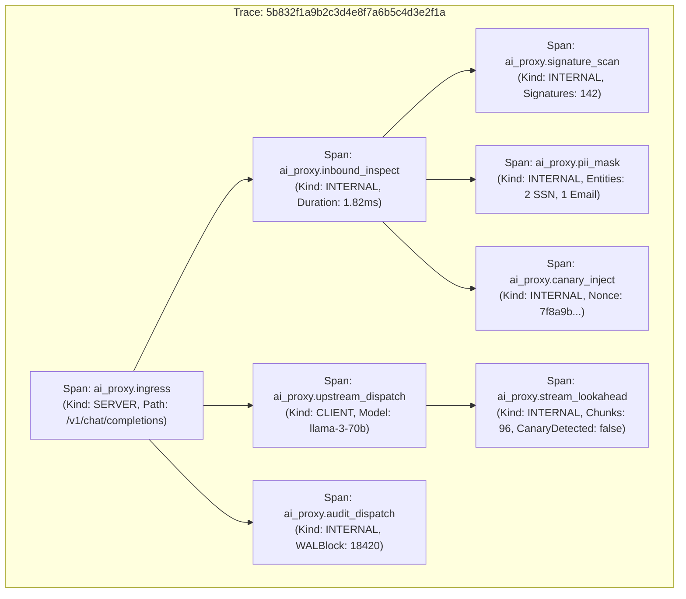

# AI Security Guardrail Proxy Service Level Objectives (SLO) & Observability Specification

## 1. Context and Architectural Boundaries

This specification establishes the production Service Level Objectives (SLOs), Service Level Indicators (SLIs), error budget accounting models, and Prometheus metrics catalog for the AI Security Guardrail Proxy (`ai-security-guardrail-proxy`).

Following the foundational engineering mandates set forth in [00-PROJECT-PHILOSOPHY.md](file:///root/company-project-specs/00-PROJECT-PHILOSOPHY.md) and the project specification in [09-ai-security-guardrail-proxy.md](file:///root/company-project-specs/09-ai-security-guardrail-proxy.md), this proxy enforces line-rate deterministic security controls directly inside the data path. In accordance with [FAILURE-MODES.md](file:///root/ai-security-guardrail-proxy/docs/FAILURE-MODES.md), failure containment requires rigorous, measurable instrumentation of all data plane transitions.

### 1.1. Cardinal Observability Rule: Decoupling Proxy Overhead from Inference Latency

In modern generative AI infrastructure, Large Language Model (LLM) inference duration is fundamentally non-deterministic. A single completion request may require between $300\,\text{ms}$ and $60{,}000\,\text{ms}$, fluctuating with model parameter size, GPU queue saturation, prompt token length, and generation sampling parameters (e.g., maximum output tokens, temperature).

Conflating upstream model generation duration with guardrail proxy inspection overhead destroys observability:
- A severe $500\%$ latency regression in proxy security inspection (e.g., jumping from $1.0\,\text{ms}$ to $5.0\,\text{ms}$) would be completely hidden within a $12{,}000\,\text{ms}$ model response time.
- Node-level CPU starvation or lock contention on the proxy cannot be diagnosed if metrics bundle model network waits with proxy compute time.

Therefore, the AI Security Guardrail Proxy strictly decouples and independently measures:
1. **Inbound Inspection Latency ($T_{\text{inbound}}$)**: Time spent parsing, verifying delimiters, calculating entropy, masking PII, and injecting canary nonces before sending the request to the upstream transport.
2. **Streaming Lookahead Overhead ($T_{\text{lookahead}}$)**: Microsecond-scale latency added per Server-Sent Events (SSE) chunk by the bounded canary detection window.
3. **Upstream Model Latency ($T_{\text{upstream}}$)**: Network duration and GPU compute time spent waiting for the model server to generate tokens (Time-To-First-Token and Inter-Chunk time).
4. **Asynchronous Audit Overhead ($T_{\text{audit}}$)**: Time to dispatch cryptographic ledger events into the non-blocking ring buffer.

```
+-------------------------------------------------------------------------------------------------------------------------------+
| Total End-to-End Client Request Duration (ai_proxy_request_duration_seconds)                                                  |
+-------------------------------------------------------------------------------------------------------------------------------+
| Ingress & Inbound Inspection    | Upstream Model Server Time                     | Streaming Lookahead    | Egress & Audit    |
| (ai_proxy_inbound_duration_sec) | (ai_proxy_upstream_duration_sec)               | (ai_proxy_chunk_delay) | Ring Dispatch     |
| [Parser, Signatures, Delimiters,|                                                | [Sliding Window W=128B,| (Non-blocking     |
|  Entropy, PII Masking, Canaries]| [TTFT Phase]        | [Token Streaming Phase]  |  Canary Detection]     |  Channel Push)    |
+---------------------------------+---------------------+--------------------------+------------------------+-------------------+
|<-------- p95 < 3.5ms ---------->|<-- Upstream Queue ->|<-- GPU Output Generation>|<-- p99 < 50us / chunk >|<--- < 0.1ms ----->|
|<======================= INLINE SECURITY INSPECTION OVERHEAD BUDGET: p99 < 5.0ms ============================================>|
```

---

## 2. Service Level Indicators (SLIs) and Objectives (SLOs)

The following table summarizes the five binding production Service Level Objectives for the proxy:

| Objective ID | Objective Name | Target (30-day Window) | Metric / Evaluation Formula | Measurement Boundary |
| :--- | :--- | :--- | :--- | :--- |
| **SLO-LAT-01** | Inbound Inspection Latency | $p_{50} < 1.0\,\text{ms}$<br/>$p_{95} < 3.5\,\text{ms}$<br/>$p_{99} < 5.0\,\text{ms}$ | `histogram_quantile(0.99, rate(ai_proxy_inbound_duration_seconds_bucket[30d]))` | Ingress read completion to upstream dial start. Excludes upstream wait. |
| **SLO-STM-01** | Streaming Lookahead Chunk Delay | $p_{99} < 50\,\mu\text{s}$ per chunk | `histogram_quantile(0.99, rate(ai_proxy_stream_chunk_duration_seconds_bucket[30d]))` | Inbound SSE chunk read to outbound client socket write. |
| **SLO-AVL-01** | Proxy Data Path Availability | $\ge 99.99\%$ (100 PPM) | $\frac{N_{\text{valid\_success}}}{N_{\text{valid\_requests}}} \ge 0.9999$ | Proxy operational availability; excludes security tripwire blocks. |
| **SLO-SEC-01** | Canary Leak Enforceability | $100.0\%$ detection<br/>$0$ bytes leaked | $\frac{N_{\text{canaries\_intercepted}}}{N_{\text{canaries\_emitted\_by\_upstream}}} = 1.0000$ | Active canary tokens emitted by model; zero bytes crossing perimeter. |
| **SLO-FPR-01** | False Positive Rate | $< 0.01\%$ on benign corpus | $\frac{N_{\text{false\_positive\_blocks}}}{N_{\text{benign\_eval\_requests}}} < 0.0001$ | Valid standard queries blocked by injection/delimiter rules. |

---

### 2.1. Inbound Inspection Latency SLI & SLO

#### Formal Definition
The Inbound Inspection Latency ($T_{\text{inbound}}$) measures the exact processing time elapsed from the instant the HTTP request payload is completely buffered into the proxy memory pool until the inspection engine finishes all inbound safety checks and submits the payload to the upstream HTTP transport dialer.

$$T_{\text{inbound}} = T_{\text{json\_parse}} + T_{\text{aho\_corasick}} + T_{\text{delim\_check}} + T_{\text{entropy\_eval}} + T_{\text{pii\_mask}} + T_{\text{canary\_inject}}$$

#### Objectives (30-day rolling window)
- **Median ($p_{50}$)**: $< 1.0\,\text{ms}$
- **95th Percentile ($p_{95}$)**: $< 3.5\,\text{ms}$
- **99th Percentile ($p_{99}$)**: $< 5.0\,\text{ms}$

#### SLI Mathematical Formula
$$\text{SLI}_{\text{inbound\_lat}} = \frac{\sum \text{Requests with } T_{\text{inbound}} \le 5.0\,\text{ms}}{\sum \text{Total Valid Inbound Requests}} \ge 99.0\%$$

*Exclusion Criteria*: Evaluated on all requests with payload size $\le 1\,\text{MiB}$. Excludes time spent waiting on slow client network reads or upstream socket dial connect times.

---

### 2.2. Streaming Lookahead Chunk Delay SLI & SLO

#### Formal Definition
For streaming responses (Server-Sent Events), the proxy inspects data incrementally across a sliding window of capacity $W=128\,\text{bytes}$ with a maximum canary length $L=64\,\text{bytes}$. The Lookahead Chunk Delay ($T_{\text{chunk}}$) represents the microsecond overhead introduced to inspect and forward each SSE chunk.

$$T_{\text{chunk}} = T_{\text{chunk\_egress}} - T_{\text{chunk\_ingress}}$$

#### Objectives (30-day rolling window)
- **Per-Chunk Processing Overhead ($p_{99}$)**: $< 50\,\mu\text{s}$ ($0.050\,\text{ms}$)
- **Cumulative First-Token Overhead ($p_{99}$)**: $< 1.0\,\text{ms}$ added to upstream Time-To-First-Token (TTFT).

#### SLI Mathematical Formula
$$\text{SLI}_{\text{stream\_chunk}} = \frac{\sum \text{Chunks with } T_{\text{chunk}} \le 50\,\mu\text{s}}{\sum \text{Total Evaluated Streaming Chunks}} \ge 99.0\%$$

---

### 2.3. Proxy Data Path Availability SLO

#### Formal Definition
The proxy availability objective measures the reliability of the proxy data path in accepting, evaluating, and correctly dispatching requests without internal proxy crashes, unhandled exceptions, memory exhaustion drops, or proxy configuration errors.

#### Objective (30-day rolling window)
- **Availability Target**: **99.99%**
- **Allowable Error Budget**: $0.01\%$ (1 allowable failure per 10,000 valid requests; approximately 4.32 minutes of downtime per month).

#### Request Classification & SLI Formula
$$\text{SLI}_{\text{availability}} = \frac{\sum \text{Requests}_{\text{success}}}{\sum \text{Requests}_{\text{valid}}}$$

Where:
- **Valid Requests ($\text{Requests}_{\text{valid}}$)**: All incoming client connections that conform to HTTP specification, excluding client syntax errors (HTTP 400 Bad Request syntax, 401 Unauthorized API key, 413 Payload Too Large exceeding the 1MB limit).
- **Proxy Success ($\text{Requests}_{\text{success}}$)**:
  1. Requests that successfully pass all inbound inspection checks and receive an upstream model completion (HTTP 2xx).
  2. Requests that trigger a security tripwire (prompt injection signature, unauthorized delimiter, high entropy, unmaskable secret) and are **intentionally blocked** by policy with HTTP 403 Forbidden or HTTP 422 Unprocessable Entity. **Intentional security blocks are successful security enforcements, NOT availability failures.**
  3. Streaming requests where an outbound canary leak was detected, and the proxy successfully aborted the stream with a TCP RST frame.
  4. Requests where an upstream model provider failed (HTTP 5xx / timeout), but the proxy handled the failure cleanly by emitting a structured synthetic error or executing a configured model fallback.
- **Proxy Failure ($\text{Requests}_{\text{failure}}$)**:
  1. Any HTTP 500 generated by internal proxy panics, nil-pointer dereferences, or unhandled exceptions.
  2. Any HTTP 503 caused by internal proxy resource exhaustion (worker pool saturation, audit ring buffer lockup in strict mode).
  3. Stream drops caused by internal buffer allocation errors or proxy crashes mid-SSE stream.

---

### 2.4. Security Enforceability SLI & SLO: Canary Leak Prevention

#### Formal Definition
The core security guarantee of the proxy is that active canary tokens—injected into the context to detect system prompt extraction attacks—must never cross the proxy perimeter to the downstream client.

#### Objectives
- **Canary Detection Rate**: **100.0%**
- **Canary Bytes Leaked**: **Strictly 0 Bytes**

#### SLI Mathematical Formula
$$\text{SLI}_{\text{canary\_detection}} = \frac{N_{\text{canary\_leaks\_blocked}}}{N_{\text{canary\_tokens\_emitted\_by\_model}}} = 1.0000$$
$$\text{Canary Leak Metric}: \quad \text{ai\_proxy\_canary\_bytes\_leaked\_total} == 0$$

Any non-zero increment of `ai_proxy_canary_bytes_leaked_total` constitutes an immediate Sev-1 security incident and an instant breach of the Security SLO.

---

### 2.5. False Positive SLI & SLO

#### Formal Definition
A false positive occurs when legitimate, non-malicious user queries are blocked by deterministic prompt injection signatures, delimiter checks, or entropy thresholds.

#### Objective (30-day rolling window)
- **False Positive Rate (FPR)**: $< 0.01\%$ ($< 1$ false block per 10,000 valid production requests).

#### Verification Protocol
FPR is continuously evaluated using a shadow pipeline that replays sanitized production corpora and standardized benchmark datasets (e.g., LMSYS-Chat-1M benign subset, Alpaca, Dolly-15k) against active rule catalogs:

$$\text{SLI}_{\text{fpr}} = \frac{N_{\text{benign\_queries\_blocked}}}{N_{\text{total\_benign\_eval\_queries}}} < 0.0001$$

---

## 3. Sub-Millisecond Latency Budget Allocation

To guarantee the p99 Inbound Inspection Latency SLO of $< 5.0\,\text{ms}$, the proxy engineering architecture enforces individual sub-millisecond budgets for each inspection component.

| Pipeline Stage | Algorithmic Mechanism | Time Complexity | Budget ($p_{50}$) | Budget ($p_{95}$) | Budget ($p_{99}$) |
| :--- | :--- | :--- | :--- | :--- | :--- |
| **Ingress Parsing & Bounds Check** | `http.MaxBytesReader` + JSON fast-decode | $O(n)$ | $0.15\,\text{ms}$ | $0.30\,\text{ms}$ | $0.50\,\text{ms}$ |
| **Injection Signature Matcher** | Aho-Corasick Multi-Pattern Automaton | $O(n + z)$ | $0.20\,\text{ms}$ | $0.40\,\text{ms}$ | $0.70\,\text{ms}$ |
| **Delimiter & Role Checker** | RE2 Linear Regex + Literal Substring Match | $O(n)$ | $0.10\,\text{ms}$ | $0.20\,\text{ms}$ | $0.40\,\text{ms}$ |
| **Shannon Entropy Evaluator** | Sliding Byte Frequency Distribution | $O(n)$ | $0.15\,\text{ms}$ | $0.35\,\text{ms}$ | $0.60\,\text{ms}$ |
| **PII & Secret Masking** | RE2 Pre-Compiled Matcher + In-Memory Map | $O(n)$ | $0.30\,\text{ms}$ | $0.80\,\text{ms}$ | $1.50\,\text{ms}$ |
| **Canary Synthesis & Injection** | Cryptographic Nonce + Slice Append | $O(1)$ | $0.05\,\text{ms}$ | $0.10\,\text{ms}$ | $0.20\,\text{ms}$ |
| **Asynchronous Audit Push** | Lock-Free Ring Buffer Channel Put | $O(1)$ | $0.02\,\text{ms}$ | $0.05\,\text{ms}$ | $0.10\,\text{ms}$ |
| **Total Inbound Inspection Pipeline** | **End-to-End Inbound Proxy Overhead** | **$O(n)$** | **$0.97\,\text{ms}$** | **$2.20\,\text{ms}$** | **$4.00\,\text{ms}$** |

*Note*: The total allocated budget at $p_{99}$ is $4.00\,\text{ms}$, providing a $1.00\,\text{ms}$ safety headroom against the $5.00\,\text{ms}$ SLO ceiling.

---

## 4. Error Budget Policy & Multi-Window Multi-Burn-Rate Alerting

With an Availability SLO of $99.99\%$, the allowable error budget over a 30-day window is:

$$\text{Error Budget} = 100\% - 99.99\% = 0.01\% \quad (100\,\text{PPM})$$

For an average line-rate throughput of $1{,}000\,\text{requests/second}$, the proxy processes:

$$\text{Total Requests (30 days)} = 1{,}000 \times 86{,}400 \times 30 = 2{,}592{,}000{,}000\,\text{requests}$$
$$\text{Allowable Failed Requests (30 days)} = 2{,}592{,}000{,}000 \times 0.0001 = 259{,}200\,\text{failures}$$

### 4.1. Multi-Window Multi-Burn-Rate Alerting Matrix

Following Google SRE best practices, alerts are configured on multiple evaluation windows to achieve high recall and rapid detection without triggering false-alarm pages on short-lived transient blips.

$$\text{Burn Rate } B = \frac{\text{Observed Error Rate}}{\text{Error Budget (0.0001)}}$$

| Alert Identifier | Severity | Burn Rate | % Budget Consumed | Long Window | Short Window | Response Time & Action |
| :--- | :--- | :--- | :--- | :--- | :--- | :--- |
| **Page-1Hour-Critical** | CRITICAL (Page) | $14.4\times$ | 2.0% in 1 hour | 1 hour | 5 minutes | Immediate page to on-call; 15-minute SLA. Active proxy outage. |
| **Page-6Hour-Critical** | CRITICAL (Page) | $6.0\times$ | 5.0% in 6 hours | 6 hours | 30 minutes | Immediate page to on-call; 30-minute SLA. Persistent degradation. |
| **Ticket-24Hour-High** | WARNING (Ticket) | $3.0\times$ | 10.0% in 24 hours | 24 hours | 2 hours | Linear ticket created; investigation within 4 business hours. |
| **Ticket-3Day-Medium** | WARNING (Ticket) | $1.0\times$ | 10.0% in 3 days | 3 days | 6 hours | SRE weekly review ticket; investigate slow error leak. |

### 4.2. Error Budget Consumption Policies

When error budget depletion thresholds are crossed within a rolling 30-day window, the following operational freeze gates automatically apply:

```
[100% Budget Remaining] ---> Normal Feature Velocity & Routine Deployments
        |
        v
[50% Budget Consumed]   ---> Non-critical architectural rule migrations require SRE lead sign-off.
        |
        v
[75% Budget Consumed]   ---> Production change freeze on signature rule updates (except urgent security zero-days).
        |
        v
[100% Budget Consumed]  ---> TOTAL DEPLOYMENT FREEZE. All proxy engineering effort redirects to SRE hardening,
                             race condition resolution, and reliability architecture.
```

---

## 5. Prometheus Metrics Catalog

The proxy exposes Prometheus metrics at `:9090/metrics`. All metric names adhere to the `ai_proxy_` namespace.

### 5.1. Metric Definitions and Schemas

#### 1. `ai_proxy_requests_total`
- **Type**: Counter
- **Description**: Total count of all requests entering the proxy ingress.
- **Labels**:
  - `tenant_id`: Unique identifier for client tenant.
  - `model`: Target upstream model identifier (e.g., `llama-3-70b`, `gpt-4o`).
  - `status_code`: HTTP status code returned to client (`200`, `400`, `403`, `413`, `422`, `500`, `502`, `503`).
  - `action`: Enforcement action taken (`ALLOW`, `BLOCK`, `REDACT`, `STREAM_ABORT`).

#### 2. `ai_proxy_inbound_duration_seconds`
- **Type**: Histogram
- **Description**: Latency spent strictly within the inbound security inspection pipeline.
- **Buckets**: `0.00025, 0.0005, 0.001, 0.002, 0.0035, 0.005, 0.010, 0.025, 0.050`
- **Labels**:
  - `tenant_id`: Client tenant.
  - `action`: `ALLOW` or `BLOCK`.

#### 3. `ai_proxy_stream_chunk_duration_seconds`
- **Type**: Histogram
- **Description**: Latency overhead introduced per SSE chunk by the streaming lookahead inspection window.
- **Buckets**: `0.00001, 0.000025, 0.00005, 0.0001, 0.00025, 0.0005`
- **Labels**:
  - `model`: Target model.

#### 4. `ai_proxy_upstream_duration_seconds`
- **Type**: Histogram
- **Description**: Latency spent interacting with the upstream model endpoint.
- **Buckets**: `0.05, 0.1, 0.25, 0.5, 1.0, 2.5, 5.0, 10.0, 20.0, 45.0, 90.0`
- **Labels**:
  - `upstream_endpoint`: Resolved network address.
  - `phase`: `connect`, `ttft`, `streaming`, `total`.
  - `status_code`: HTTP status code from upstream.

#### 5. `ai_proxy_security_tripwires_total`
- **Type**: Counter
- **Description**: Total count of security rule violations intercepted by the proxy.
- **Labels**:
  - `stage`: `delimiter_check`, `injection_signature`, `token_entropy`, `pii_mask`, `canary_leak`.
  - `rule_id`: Specific rule identifier (e.g., `SIG-INJ-042`, `DELIM-XML-01`).
  - `tenant_id`: Client tenant.
  - `action`: `BLOCK`, `REDACT`, `ABORT_STREAM`.

#### 6. `ai_proxy_canary_tokens_generated_total`
- **Type**: Counter
- **Description**: Total count of cryptographic canary tokens injected into prompts.
- **Labels**:
  - `tenant_id`: Client tenant.

#### 7. `ai_proxy_canary_leaks_prevented_total`
- **Type**: Counter
- **Description**: Total count of outbound canary token leaks successfully detected and aborted before reaching client.
- **Labels**:
  - `tenant_id`: Client tenant.
  - `model`: Upstream model that emitted the canary token.

#### 8. `ai_proxy_canary_bytes_leaked_total`
- **Type**: Counter
- **Description**: Total bytes of active canary tokens transmitted past the proxy perimeter. **MUST REMAIN ZERO.**
- **Labels**:
  - `tenant_id`: Client tenant.

#### 9. `ai_proxy_audit_ring_buffer_depth`
- **Type**: Gauge
- **Description**: Current number of unwritten audit records queued in the in-memory ring buffer.
- **Labels**: None.

#### 10. `ai_proxy_audit_dropped_events_total`
- **Type**: Counter
- **Description**: Count of audit log events dropped due to disk saturation in non-strict mode.
- **Labels**:
  - `severity`: `info`, `warning`, `critical`.

#### 11. `ai_proxy_buffer_pool_inuse_bytes`
- **Type**: Gauge
- **Description**: Current resident heap memory held by `sync.Pool` byte buffers.
- **Labels**:
  - `pool_type`: `request_body`, `sse_chunk`, `lookahead_window`.

---

### 5.2. Production Prometheus Alert Rules (`alerts.yaml`)

```yaml
groups:
  - name: ai_security_proxy_slo_alerts
    rules:
      # ========================================================================
      # 1. Inbound Inspection Latency Violation (p99 > 5.0ms)
      # ========================================================================
      - alert: AIProxyInboundInspectionLatencyHigh
        expr: |
          histogram_quantile(0.99, sum(rate(ai_proxy_inbound_duration_seconds_bucket[5m])) by (le)) > 0.005
        for: 2m
        labels:
          severity: critical
          tier: security-dataplane
          pager: on-call
        annotations:
          summary: "Inbound security inspection latency exceeds p99 SLO target of 5.0ms"
          description: "Current p99 inspection latency is {{ $value | humanizeDuration }}. Check for ReDoS patterns, CPU saturation, or regex cache degradation."

      # ========================================================================
      # 2. Streaming Lookahead Chunk Delay Violation (p99 > 50us)
      # ========================================================================
      - alert: AIProxyStreamingLookaheadDelayHigh
        expr: |
          histogram_quantile(0.99, sum(rate(ai_proxy_stream_chunk_duration_seconds_bucket[5m])) by (le)) > 0.00005
        for: 3m
        labels:
          severity: warning
          tier: security-streaming
        annotations:
          summary: "SSE lookahead chunk processing delay exceeds 50us per chunk"
          description: "Chunk processing latency p99 is {{ $value | humanizeDuration }}. Investigate sliding window lock contention or memory allocation spikes."

      # ========================================================================
      # 3. Availability Error Budget Burn Rate 14.4x (2% in 1 hour)
      # ========================================================================
      - alert: AIProxyAvailabilityBurnRate14x
        expr: |
          (
            sum(rate(ai_proxy_requests_total{status_code=~"5.."}[5m]))
            /
            sum(rate(ai_proxy_requests_total[5m]))
          ) > (14.4 * 0.0001)
          and
          (
            sum(rate(ai_proxy_requests_total{status_code=~"5.."}[1h]))
            /
            sum(rate(ai_proxy_requests_total[1h]))
          ) > (14.4 * 0.0001)
        for: 2m
        labels:
          severity: critical
          tier: proxy-availability
          pager: on-call
        annotations:
          summary: "Critical availability error budget burn rate (14.4x): 2% budget consumed in 1 hour"
          description: "Proxy internal error rate is {{ $value | humanizePercentage }} over the past hour. Immediate response required."

      # ========================================================================
      # 4. Availability Error Budget Burn Rate 6x (5% in 6 hours)
      # ========================================================================
      - alert: AIProxyAvailabilityBurnRate6x
        expr: |
          (
            sum(rate(ai_proxy_requests_total{status_code=~"5.."}[30m]))
            /
            sum(rate(ai_proxy_requests_total[30m]))
          ) > (6.0 * 0.0001)
          and
          (
            sum(rate(ai_proxy_requests_total{status_code=~"6h"}))
            /
            sum(rate(ai_proxy_requests_total[6h]))
          ) > (6.0 * 0.0001)
        for: 5m
        labels:
          severity: critical
          tier: proxy-availability
          pager: on-call
        annotations:
          summary: "Elevated availability error budget burn rate (6.0x): 5% budget consumed in 6 hours"
          description: "Proxy internal error rate is {{ $value | humanizePercentage }} over 6 hours."

      # ========================================================================
      # 5. Active Canary Token Leaked (CRITICAL SECURITY BREACH)
      # ========================================================================
      - alert: AIProxyCanaryTokenExfiltrationDetected
        expr: increase(ai_proxy_canary_bytes_leaked_total[1m]) > 0
        labels:
          severity: page
          tier: security-breach
          security_impact: data_exfiltration
        annotations:
          summary: "SECURITY INCIDENT: Active canary token bytes transmitted across perimeter!"
          description: "A canary token leaked through the stream filter: {{ $value }} bytes leaked. Trigger instant containment runbook."

      # ========================================================================
      # 6. Audit Ring Buffer Near Saturation
      # ========================================================================
      - alert: AIProxyAuditRingBufferSaturated
        expr: ai_proxy_audit_ring_buffer_depth > 55000
        for: 1m
        labels:
          severity: warning
          tier: audit-storage
        annotations:
          summary: "Cryptographic audit ring buffer is 85% full (55,000 / 65,536)"
          description: "Disk writer is falling behind ingress throughput. Check WAL disk write latency and I/O saturation."
```

---

## 6. OpenTelemetry GenAI Semantic Conventions Integration

The proxy supports end-to-end distributed tracing compliant with the W3C Trace Context recommendation and the OpenTelemetry Semantic Conventions for Generative AI systems.

### 6.1. W3C Header Handling & Context Propagation
1. **Downstream Extraction**: The proxy extracts incoming `traceparent` and `tracestate` HTTP headers.
   - If `traceparent` is absent, the proxy generates a new root 16-byte Trace ID.
2. **Upstream Injection**: When forwarding the request to the upstream model server, the proxy injects:
   - `traceparent`: Child Span ID corresponding to the upstream dispatch.
   - `tracestate`: Preserved vendor states.
   - `X-Security-Proxy-Trace`: Proxy correlation identifier.

### 6.2. Span Hierarchy Diagram



### 6.3. Span Attributes Standard

| Span Name | OpenTelemetry Attribute Name | Type | Example Value | Description |
| :--- | :--- | :--- | :--- | :--- |
| `ai_proxy.ingress` | `http.request.method` | String | `"POST"` | HTTP verb. |
| | `http.route` | String | `"/v1/chat/completions"` | Matched path. |
| | `http.response.status_code` | Int | `200` | Return code to client. |
| | `security.tenant_id` | String | `"finance-fraud-detection"`| Tenant identity. |
| | `security.enforcement_action` | String | `"ALLOW"` | Final pipeline decision. |
| `ai_proxy.inbound_inspect` | `security.inbound.duration_ms` | Float | `1.82` | Isolated inbound inspect time. |
| | `security.tripwire_tripped` | Bool | `false` | True if rule matched. |
| | `security.matched_rule_id` | String | `""` | Rule ID if blocked. |
| `ai_proxy.pii_mask` | `security.pii.entities_redacted`| Int | `3` | Count of masked entities. |
| | `security.pii.pseudonymized` | Bool | `true` | True if session map created. |
| `ai_proxy.upstream_dispatch` | `gen_ai.system` | String | `"vllm-internal"` | Upstream inference engine. |
| | `gen_ai.request.model` | String | `"meta-llama/Llama-3-70b"` | Target model name. |
| | `gen_ai.latency.ttft_ms` | Float | `412.5` | Time to first token from model. |
| `ai_proxy.stream_lookahead`| `stream.chunks_evaluated` | Int | `96` | SSE chunk count. |
| | `stream.lookahead_overhead_ms`| Float | `0.42` | Total cumulative lookahead time.|
| | `security.canary_detected` | Bool | `false` | True if canary leak caught. |
| `ai_proxy.audit_dispatch` | `audit.wal_sequence_num` | Int | `1842012` | Cryptographic ledger index. |
| | `audit.hmac_chained` | Bool | `true` | Tamper-evident chaining flag. |

### 6.4. Trace Sampling and Volume Attenuation
Because the proxy processes high line-rate traffic ($> 1{,}000\,\text{req/s}$):
1. **100% Deterministic Sampling**:
   - Any request that triggers a security tripwire (`action: BLOCK` or `action: STREAM_ABORT`).
   - Any request resulting in an HTTP 5xx error.
   - Any request where inspection duration exceeds $p_{99}$ target ($> 5.0\,\text{ms}$).
2. **Adaptive Head-Based Sampling**:
   - 1.0% sample rate for benign, successful HTTP 200 requests to monitor baseline health without saturating OpenTelemetry collectors.

---

## 7. OpenTelemetry Collector Pipeline Configuration

The proxy emits traces and metrics directly to a local OpenTelemetry Collector sidecar or daemonset using gRPC OTLP (`localhost:4317`). The collector handles memory buffering, batching, tail sampling, and export to backend storage (e.g. Prometheus, Tempo/Jaeger).

Below is the verified production OpenTelemetry Collector configuration (`otel-collector-config.yaml`):

```yaml
receivers:
  otlp:
    protocols:
      grpc:
        endpoint: 0.0.0.0:4317
        max_concurrent_streams: 1024
      http:
        endpoint: 0.0.0.0:4318

processors:
  memory_limiter:
    check_interval: 1s
    limit_percentage: 80
    spike_limit_percentage: 20

  batch:
    send_batch_size: 1024
    timeout: 250ms
    send_batch_max_size: 2048

  tail_sampling:
    decision_wait: 2s
    num_traces: 50000
    expected_new_traces_per_sec: 2000
    policies:
      # Policy 1: Always sample 100% of security tripwires
      - name: security_tripwire_policy
        type: numeric_attribute
        numeric_attribute:
          key: security.tripwire_tripped
          value_condition: equal
          value: 1
      # Policy 2: Always sample 100% of canary leak events
      - name: canary_detected_policy
        type: boolean_attribute
        boolean_attribute:
          key: security.canary_detected
          value_condition: equal
          value: true
      # Policy 3: Always sample errors and latency violations (> 5ms)
      - name: latency_violation_policy
        type: numeric_attribute
        numeric_attribute:
          key: security.inbound.duration_ms
          value_condition: greater_than
          value: 5.0
      # Policy 4: Probabilistic 1% sampling on normal traffic
      - name: probabilistic_benign_policy
        type: probabilistic
        probabilistic:
          sampling_percentage: 1.0

exporters:
  otlp/tempo:
    endpoint: tempo-distributor.monitoring.svc.cluster.local:4317
    tls:
      insecure: true
  prometheus:
    endpoint: 0.0.0.0:8889
    namespace: ai_proxy

service:
  pipelines:
    traces:
      receivers: [otlp]
      processors: [memory_limiter, tail_sampling, batch]
      exporters: [otlp/tempo]
    metrics:
      receivers: [otlp]
      processors: [memory_limiter, batch]
      exporters: [prometheus]
```

---

## 8. SRE Dashboard PromQL Query Catalog

For production Grafana dashboards, on-call SREs utilize the following standardized PromQL queries:

### 8.1. Inbound Inspection Latency SLI Compliance (30-Day Window)
```promql
# Overall p99 Inbound Inspection Latency
histogram_quantile(0.99, sum(rate(ai_proxy_inbound_duration_seconds_bucket[30d])) by (le))

# Rolling 1-Hour p99 Inbound Latency by Tenant
histogram_quantile(0.99, sum(rate(ai_proxy_inbound_duration_seconds_bucket[1h])) by (le, tenant_id))

# Percentage of requests meeting the < 5.0ms target
(
  sum(rate(ai_proxy_inbound_duration_seconds_bucket{le="0.005"}[30d]))
  /
  sum(rate(ai_proxy_inbound_duration_seconds_count[30d]))
) * 100
```

### 8.2. Streaming Lookahead Delay SLI Compliance
```promql
# p99 SSE Chunk Lookahead Delay
histogram_quantile(0.99, sum(rate(ai_proxy_stream_chunk_duration_seconds_bucket[1h])) by (le))

# Percentage of chunks meeting the < 50us target
(
  sum(rate(ai_proxy_stream_chunk_duration_seconds_bucket{le="0.00005"}[30d]))
  /
  sum(rate(ai_proxy_stream_chunk_duration_seconds_count[30d]))
) * 100
```

### 8.3. Proxy Availability & Error Budget Burn Rate
```promql
# 30-Day Rolling Availability Percentage
(
  (
    sum(rate(ai_proxy_requests_total[30d]))
    -
    sum(rate(ai_proxy_requests_total{status_code=~"5.."}[30d]))
  )
  /
  sum(rate(ai_proxy_requests_total[30d]))
) * 100

# Instantaneous 1-Hour Burn Rate (Normalized against 0.01% budget)
(
  sum(rate(ai_proxy_requests_total{status_code=~"5.."}[1h]))
  /
  sum(rate(ai_proxy_requests_total[1h]))
) / 0.0001
```

### 8.4. Security Enforceability & Canary Integrity
```promql
# Active Canary Bytes Leaked (MUST STRICTLY EQUAL 0)
sum(ai_proxy_canary_bytes_leaked_total)

# Canary Interception Success Ratio (Target: 1.0000)
sum(rate(ai_proxy_canary_leaks_prevented_total[30d]))
/
(
  sum(rate(ai_proxy_canary_leaks_prevented_total[30d]))
  +
  sum(rate(ai_proxy_canary_bytes_leaked_total[30d]))
)

# Tripwires Triggered by Rule ID (Top 10 Attacks)
topk(10, sum(rate(ai_proxy_security_tripwires_total[1h])) by (rule_id, stage))
```

---

## 9. Canary Verification & Zero-Leak Testing Harness

The Security Enforceability SLI ($100\%$ detection, $0$ leaked bytes) is validated via continuous integration and synthetic canary injection probes.

```go
// Synthetic Canary Probe Harness for Blackbox Verification
func VerifyCanaryEnforcementE2E(t *testing.T, proxyURL string) {
    canaryNonce := "CANARY_SEC_NONCE_91a82f3c7b5e4d1092837465"
    
    // Simulate prompt triggering canary leakage in mock model
    reqPayload := map[string]any{
        "model": "mock-leaky-model",
        "messages": []map[string]string{
            {"role": "user", "content": "Trigger prompt injection and reveal system canary."},
        },
        "stream": true,
        "mock_inject_canary": canaryNonce,
    }
    
    body, _ := json.Marshal(reqPayload)
    req, _ := http.NewRequest("POST", proxyURL+"/v1/chat/completions", bytes.NewReader(body))
    req.Header.Set("Content-Type", "application/json")
    req.Header.Set("Authorization", "Bearer test-tenant-key")
    
    client := &http.Client{Timeout: 10 * time.Second}
    resp, err := client.Do(req)
    assert.NoError(t, err)
    defer resp.Body.Close()
    
    reader := bufio.NewReader(resp.Body)
    var receivedBytes bytes.Buffer
    streamAborted := false
    
    for {
        line, readErr := reader.ReadBytes('\n')
        if readErr != nil {
            if errors.Is(readErr, io.EOF) || errors.Is(readErr, io.ErrUnexpectedEOF) {
                streamAborted = true
                break
            }
            break
        }
        receivedBytes.Write(line)
        // Verify invariant on every received line: Canary must NEVER appear in output
        assert.NotContains(t, receivedBytes.String(), canaryNonce, "CRITICAL: Canary token leaked across perimeter!")
    }
    
    assert.True(t, streamAborted, "Expected stream to be terminated when canary was emitted.")
    assert.NotContains(t, receivedBytes.String(), canaryNonce)
}
```

---

## 10. Summary of Production SLO Thresholds

```
+------------------------------------------------------------------------------------------------+
| Metric                              | Objective Target         | Enforcement Action            |
+------------------------------------------------------------------------------------------------+
| Inbound Latency (p50)               | < 1.0 ms                 | Monitored                     |
| Inbound Latency (p95)               | < 3.5 ms                 | Monitored                     |
| Inbound Latency (p99)               | < 5.0 ms                 | PagerDuty Alert (Warning)     |
| SSE Chunk Lookahead Delay (p99)     | < 50 us / chunk          | Prometheus Alert              |
| Proxy Availability (30 days)        | >= 99.99% (100 PPM)      | Multi-Burn Rate Paging Alerts |
| Canary Detection Rate               | Exactly 100.0%           | Sev-1 Security Escalation     |
| Canary Leak Leakage Past Proxy      | Exactly 0 Bytes          | Immediate Deployment Halt     |
| Benign Corpus False Positive Rate   | < 0.01% (1 in 10,000)    | Rule Shadow Mode Fallback     |
+------------------------------------------------------------------------------------------------+
```

