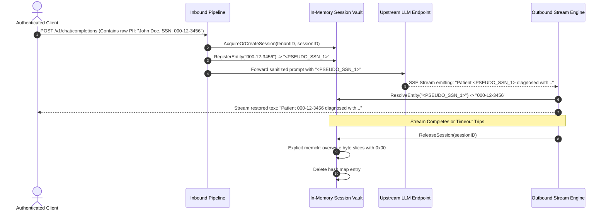

# ADR-004: Canary Token and Pseudonymization Lifecycle

- **Status**: Accepted
- **Deciders**: Core Architecture Team
- **Date**: 2026-09-22
- **Context Files**:
  - [00-PROJECT-PHILOSOPHY.md](file:///root/company-project-specs/00-PROJECT-PHILOSOPHY.md)
  - [09-ai-security-guardrail-proxy.md](file:///root/company-project-specs/09-ai-security-guardrail-proxy.md)
  - [OPERATIONS.md](file:///root/ai-security-guardrail-proxy/docs/OPERATIONS.md)
  - [ADR-001-language-and-runtime-selection.md](file:///root/ai-security-guardrail-proxy/docs/adr/ADR-001-language-and-runtime-selection.md)
  - [ADR-002-deterministic-inspection-pipeline.md](file:///root/ai-security-guardrail-proxy/docs/adr/ADR-002-deterministic-inspection-pipeline.md)

---

## 1. Context and Problem Statement

The AI Security Guardrail Proxy must maintain state across the request-response lifecycle for two critical security capabilities:

1. **Canary Token Synthesis and Leak Detection**:
   To detect system prompt extraction attacks and indirect prompt injection exfiltration, the proxy synthesizes unique canary tokens on inbound requests and injects them into protected system prompts. If an attacker persuades the model to leak its instructions, or if an indirect injection payload tricks the model into repeating internal context, the outbound inspector catches the canary token in the streaming response and immediately severs the connection.
2. **Reversible PII Pseudonymization & De-Anonymization**:
   To satisfy data residency and privacy regulations (GDPR, HIPAA, CCPA), raw sensitive data (Social Security Numbers, email addresses, credit card numbers, patient identifiers) must never reach third-party model inference providers or internal GPU clusters unmasked. The inbound pipeline detects sensitive entities, replaces them with deterministic pseudonyms (e.g., `<PSEUDO_EMAIL_1>`), and records the mapping. On the outbound streaming path, the proxy reverses the pseudonyms back to their original values before delivering the response to the authenticated client.

### The Architectural Dilemma

Traditional enterprise architectures persist stateful mappings in an external distributed cache or database (such as Redis, DynamoDB, or PostgreSQL). However, for an inline security proxy, delegating canary registries and PII pseudonymization maps to an external database introduces fatal operational and security vulnerabilities:
- **Violates Zero-External-Dependency Invariant**: External databases introduce network round-trips, connection pools, authentication secrets, and availability dependencies. A network partition between the proxy and Redis halts all LLM traffic.
- **Data Remanence and Regulatory Non-Compliance**: Storing plaintext PII or reversal keys in external persistent storage leaves residual data in database logs, replication streams, snapshots, and swap space, violating strict "zero data at rest" guarantees.
- **Latency Budget Destruction**: Querying a remote database twice per request (once during inbound tokenization and once during outbound stream de-pseudonymization) adds 2ms to 15ms of network I/O, obliterating our sub-millisecond p99 latency SLO.
- **Cross-Tenant Collisions and Isolation Risks**: A shared multi-tenant database risks catastrophic data leakage if an operator misconfigures namespace prefixes or if key collision vulnerabilities exist.

We must define the lifecycle, cryptographic foundation, and storage architecture for canary tokens and reversible pseudonymization mappings.

---

## 2. Decision Drivers

1. **Zero External Daemon Dependencies**: The entire state management lifecycle must execute in-process with zero reliance on Redis, PostgreSQL, or remote caches.
2. **Deterministic Memory Zeroization**: Mappings and raw PII values must be wiped from process memory (using explicit memory zeroization) the instant the request/response transaction completes or times out.
3. **Cryptographic Tenant Isolation**: Pseudonymization mappings and canary tokens must be cryptographically partitioned by `tenant_id` and `session_id`, making cross-tenant data access mathematically impossible.
4. **Sub-Millisecond Execution Overhead**: In-memory lookups, HMAC generation, and string substitution must execute in under $100\mu\text{s}$ per transaction.
5. **Unforgeable Canary Tokens**: Canary tokens must be mathematically unguessable by adversarial users and models.
6. **Bounded Memory Footprint**: The in-memory vault must enforce strict capacity ceilings and TTL expiries to prevent memory exhaustion under adversarial load.

---

## 3. Considered Options

We evaluated three state architectures:

1. **Session-Scoped In-Memory HMAC Vault with Explicit Zeroization (Selected)**
2. **Centralized Persistent Database / Distributed Cache (Redis / PostgreSQL)**
3. **Stateless Client-Side Encrypted Cookie / Header Tokens**

---

## 4. Deep Technical Comparison

### 4.1 Comparison Matrix

| Evaluation Dimension | In-Memory HMAC Vault (Selected) | Centralized Cache (Redis) | Stateless Client-Side Cookie |
| :--- | :--- | :--- | :--- |
| **External Dependencies** | **Zero (autonomous in-process)** | High (Redis cluster, Sentinel, DNS) | Zero (carried in HTTP headers) |
| **Data Remanence at Rest** | **Zero (explicit zeroization on session close)** | High (Redis RDB/AOF disk dumps, replication logs) | Low (stored in client browser / app memory) |
| **Lookup Latency Overhead** | **< 0.05ms (in-memory hash table)** | 1.5ms - 8.0ms (TCP socket roundtrip) | < 0.1ms (in-memory AES-GCM decrypt) |
| **Tenant Isolation Mechanism** | In-process memory sharding with HMAC partitioning | Logical key prefixing (`tenant:key`) | Client-held ciphertext |
| **Failure Mode on Partition** | **Completely immune (no network calls)** | Total proxy outage or fail-open data leak | Immune to network partitions |
| **Susceptibility to Replay** | High entropy HMAC seed + sequence counter | Handled via Redis expiration | Vulnerable unless nonce replay cache added |
| **Payload Size Impact** | Zero (tokens remain concise) | Zero | High (bloats request headers by 2KB–8KB) |
| **Context Window Consumption** | Negligible (compact 32-byte canaries) | Negligible | Dangerous (complex encrypted tokens confuse LLM) |

---

### 4.2 Detailed Evaluation of Rejected Alternatives

#### Alternative 2: Centralized Cache / Database (Redis / PostgreSQL)

*Why it was considered*:
Redis is the industry-standard choice for shared session state, offering fast in-memory key-value lookups and native TTL expiration.

*Why it was rejected*:
1. **Direct Violation of Core Invariant**: Our specification mandates **zero external daemon dependencies**. Running Redis introduces an external failure domain, operational maintenance, and network partition failure modes.
2. **Regulatory and Compliance Liability**: Storing PII pseudonymization maps in Redis writes unmasked customer data to Redis memory, replication links, and snapshot files (`dump.rdb`). In the event of a security audit or breach, proving that PII was purged is nearly impossible due to unmanaged OS memory caching and persistence logs.
3. **Latency Penalty**: Network round-trips over loopback or VPC networks add 1ms to 5ms of latency. In streaming LLM traffic, querying Redis on every chunk or connection boundary degrades throughput.

#### Alternative 3: Stateless Client-Side Encrypted Cookie / Header Tokens

*Why it was considered*:
Encrypting the pseudonymization map with an internal AES-256-GCM key and transmitting it to the client via an HTTP header (e.g., `X-Guardrail-Vault`) allows the proxy to remain completely stateless across multi-turn interactions.

*Why it was rejected*:
1. **Header Size Limits**: Multi-turn prompts containing numerous entities (e.g., medical records with 30 names, dates, addresses, and diagnoses) generate pseudonymization maps exceeding 8KB–16KB. Standard reverse proxies, CDNs, and load balancers reject HTTP requests with headers exceeding 8KB with `431 Request Header Fields Too Large`.
2. **Model Context Window Leakage**: If an agent or model receives an encrypted state token in its context, adversarial prompting can manipulate the LLM into mutating or echoing the ciphertext, corrupting the session state.

---

## 5. Decision Outcome

We select **Alternative 1: Session-Scoped In-Memory HMAC Vault with Explicit Memory Zeroization**.

### 5.1 Canary Token Cryptographic Architecture

Canary tokens are synthesized dynamically for every inbound conversational session using HMAC-SHA256:

$$\text{Canary} = \text{Prefix} \,\|\, \text{Hex}\Big(\text{HMAC-SHA256}\big(K_{\text{seed}}, \text{TenantID} \,\|\, \text{SessionID} \,\|\, \text{SequenceNum}\big)[:16]\Big)$$

- **Deterministic Verification**: Because the canary is an HMAC of the session identifier, the outbound inspection engine can verify canary ownership in constant time without searching an unbounded string database.
- **Unforgeability**: An adversary cannot guess or generate a valid canary token without knowledge of the 256-bit cryptographic `hmac_secret_seed`.
- **Length Invariant**: Every canary is precisely 32 bytes (`CORP-SEC-CANARY-` [16 bytes] + 16 hex characters [16 bytes]), perfectly matching the sliding window overlap margin ($L_{\text{overlap}} = 64\text{ bytes}$).

```text
+───────────────────────────────────────────────────────────────+
|                  Canary Token Structure (32 bytes)            |
+───────────────────────────────┬───────────────────────────────+
| Prefix: "CORP-SEC-CANARY-"    | Truncated HMAC-SHA256: 16 hex |
| (16 bytes, ASCII)             | (16 bytes, Cryptographic ID)  |
+───────────────────────────────┴───────────────────────────────+
```

---

### 5.2 Pseudonymization Vault & Memory Zeroization Lifecycle



#### Zeroization Guarantees:
- **No Residual PII**: When the HTTP streaming connection finishes (or upon client disconnect / timeout), `ReleaseSession` executes. All raw string byte slices in the vault are explicitly overwritten with zeroes (`0x00`) before the map reference is discarded, preventing memory scraping via core dumps or GC delays.
- **Strict Tenant Partitioning**: The in-memory vault uses composite shard keys: `SHA256(tenant_id || ":" || session_id)`. Cross-tenant lookups are impossible.
- **Bounded Capacity & TTL Eviction**: Inactive sessions are purged after a strict TTL (`vault_session_ttl_seconds: 3600`). A global session ceiling (`max_active_sessions: 100000`) prevents Denial of Service (DoS) memory exhaustion.

---

## 6. Implementation Details & Architectural Blueprints

### 6.1 Cryptographic Canary Generator

```go
package canary

import (
	"crypto/hmac"
	"crypto/sha256"
	"encoding/hex"
	"fmt"
	"sync/atomic"
)

type CanaryGenerator struct {
	prefix     string
	secretSeed []byte
	counter    atomic.Uint64
}

func NewCanaryGenerator(prefix string, secretSeedHex string) (*CanaryGenerator, error) {
	seed, err := hex.DecodeString(secretSeedHex)
	if err != nil || len(seed) < 32 {
		return nil, fmt.Errorf("invalid canary secret seed: must be at least 32 bytes hex")
	}
	return &CanaryGenerator{
		prefix:     prefix,
		secretSeed: seed,
	}, nil
}

// GenerateSynthesizedToken creates a unique, unforgeable 32-byte canary string.
func (cg *CanaryGenerator) GenerateSynthesizedToken(tenantID, sessionID string) string {
	seq := cg.counter.Add(1)
	
	mac := hmac.New(sha256.New, cg.secretSeed)
	mac.Write([]byte(tenantID))
	mac.Write([]byte(":"))
	mac.Write([]byte(sessionID))
	mac.Write([]byte(fmt.Sprintf(":%d", seq)))
	
	fullDigest := mac.Sum(nil)
	tokenSuffix := hex.EncodeToString(fullDigest[:8]) // 8 bytes = 16 hex chars
	
	return cg.prefix + tokenSuffix
}
```

---

### 6.2 Session-Scoped Vault with Explicit Memory Zeroization

```go
package vault

import (
	"sync"
	"time"
)

// SessionMapping stores reversible entity substitutions for a single session.
type SessionMapping struct {
	mu           sync.RWMutex
	forwardMap   map[string]string // raw -> pseudo
	reverseMap   map[string][]byte // pseudo -> raw bytes (for zeroization)
	lastAccessed time.Time
}

// SessionVault manages concurrent, partitioned in-memory session mappings.
type SessionVault struct {
	mu          sync.RWMutex
	sessions    map[string]*SessionMapping
	maxCapacity int
	ttl         time.Duration
}

func NewSessionVault(maxCapacity int, ttl time.Duration) *SessionVault {
	v := &SessionVault{
		sessions:    make(map[string]*SessionMapping, 1024),
		maxCapacity: maxCapacity,
		ttl:         ttl,
	}
	go v.startCleanupWorker()
	return v
}

// Store registers a raw sensitive entity and returns its deterministic pseudonym.
func (v *SessionVault) Store(sessionID, rawEntity, pseudoEntity string) {
	v.mu.Lock()
	sm, exists := v.sessions[sessionID]
	if !exists {
		if len(v.sessions) >= v.maxCapacity {
			v.evictOldest()
		}
		sm = &SessionMapping{
			forwardMap: make(map[string]string, 8),
			reverseMap: make(map[string][]byte, 8),
		}
		v.sessions[sessionID] = sm
	}
	v.mu.Unlock()

	sm.mu.Lock()
	defer sm.mu.Unlock()
	sm.lastAccessed = time.Now()
	sm.forwardMap[rawEntity] = pseudoEntity
	sm.reverseMap[pseudoEntity] = []byte(rawEntity)
}

// Resolve retrieves the original raw entity from its pseudonym.
func (v *SessionVault) Resolve(sessionID, pseudoEntity string) ([]byte, bool) {
	v.mu.RLock()
	sm, exists := v.sessions[sessionID]
	v.mu.RUnlock()
	if !exists {
		return nil, false
	}

	sm.mu.RLock()
	defer sm.mu.RUnlock()
	val, found := sm.reverseMap[pseudoEntity]
	return val, found
}

// Destroy immediately wipes all raw entity memory and removes the session.
func (v *SessionVault) Destroy(sessionID string) {
	v.mu.Lock()
	sm, exists := v.sessions[sessionID]
	delete(v.sessions, sessionID)
	v.mu.Unlock()

	if !exists {
		return
	}

	sm.mu.Lock()
	defer sm.mu.Unlock()

	// Cryptographic zeroization: overwrite all raw sensitive byte slices with zeroes
	for _, rawBytes := range sm.reverseMap {
		for i := range rawBytes {
			rawBytes[i] = 0
		}
	}
	clear(sm.forwardMap)
	clear(sm.reverseMap)
}

func (v *SessionVault) evictOldest() {
	var oldestKey string
	var oldestTime time.Time

	for k, sm := range v.sessions {
		if oldestKey == "" || sm.lastAccessed.Before(oldestTime) {
			oldestKey = k
			oldestTime = sm.lastAccessed
		}
	}
	if oldestKey != "" {
		v.Destroy(oldestKey)
	}
}

func (v *SessionVault) startCleanupWorker() {
	ticker := time.NewTicker(30 * time.Second)
	for range ticker.C {
		v.mu.Lock()
		now := time.Now()
		for k, sm := range v.sessions {
			if now.Sub(sm.lastAccessed) > v.ttl {
				v.mu.Unlock()
				v.Destroy(k)
				v.mu.Lock()
			}
		}
		v.mu.Unlock()
	}
}
```

---

## 7. Consequences & Operational Mandates

### Positive Consequences
- **Regulatory Compliance by Architecture**: PII is never written to disk, database logs, or external caches. Zero data remanence is cryptographically and operationally guaranteed.
- **Zero External Daemon Failure Modes**: The proxy cannot fail due to Redis partitions, connection saturation, or external database maintenance.
- **Ultra-Fast Line-Rate Substitution**: Map lookups and replacements execute strictly in-memory in under 50 microseconds.

### Negative Consequences and Mitigations
- **Single-Node Session Locality**: In a multi-replica Kubernetes deployment, outbound de-pseudonymization requires that the outbound streaming response is handled by the same proxy pod that evaluated the inbound request.
  - *Mitigation*: The proxy processes both the inbound prompt forwarding and outbound streaming response within the **same HTTP transaction**. The HTTP connection remains pinned to the specific proxy pod for the duration of the request/response lifecycle. Long-lived multi-turn session persistence across separate HTTP requests is keyed by session ID with sticky ingress routing (e.g., cookie or header-based load balancer session affinity).

---

## 8. References

- [00-PROJECT-PHILOSOPHY.md](file:///root/company-project-specs/00-PROJECT-PHILOSOPHY.md): Boring, reliable infrastructure; secure defaults; systems that survive two years of ownership.
- [09-ai-security-guardrail-proxy.md](file:///root/company-project-specs/09-ai-security-guardrail-proxy.md): PII masking, reversible pseudonymization, and canary token lifecycle.
- [OPERATIONS.md](file:///root/ai-security-guardrail-proxy/docs/OPERATIONS.md): Runbook 2 (Canary Token Leakage Incident Protocol).
